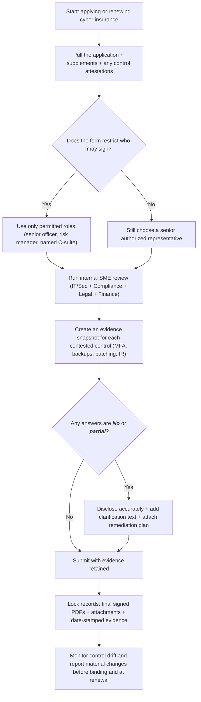
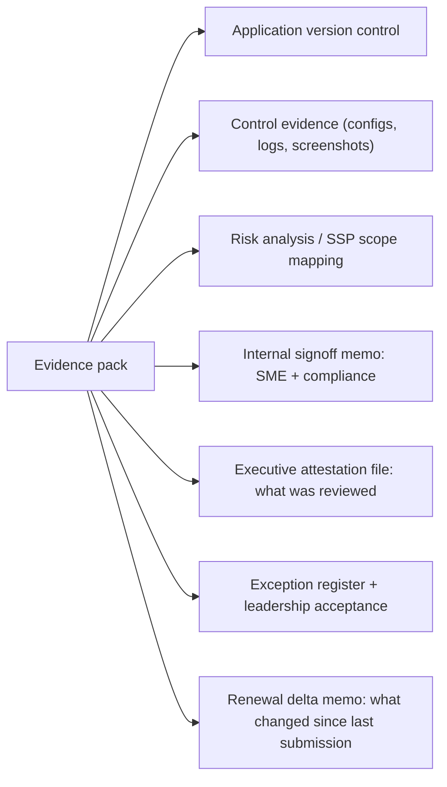

***CAUTION: This report was generated with LLM assistance for research and drafting. The citations have NOT been reviewed yet! Please mark the tested citations until all have been validated, then remove this warning.***

# Executive attestations and signoff in cyber insurance underwriting and coverage

## Executive summary

In U.S. cyber insurance, “executive signoff” almost always happens, but it often shows up as a signature on underwriting documents (the application, supplements, and security attestations) rather than as a formal board certification of the security program. Across representative carrier application forms, the signature is commonly restricted to a senior officer, risk manager, or named C‑suite roles, and it typically includes language like “after reasonable inquiry” and “may be relied upon” as the basis of the insurance contract. [^1]

The practical reality: even when security operations staff supply the facts, an executive (or executive-equivalent) often becomes the attesting signer, creating personal and organizational exposure if responses are wrong or overstated. That exposure is not theoretical. A widely cited example is Travelers Property Casualty Company of America v. International Control Services, where the insurer sought rescission based on alleged misstatements about MFA in signed application documents; the case ended with an agreed court order rescinding the policy and declaring it void from inception, with the parties stipulating no coverage for any claims under that policy. [^2]

Board-level certifications are not the default in cyber insurance, but “who counts as the knowledge holder” is frequently defined in policy forms via “Control Group” or “Executive Officer” concepts, which then drive notice obligations and misrepresentation consequences. This is where governance intersects insurance mechanics, even if the insurer never asks for “board minutes.” [^3]

## Where executive signoff shows up in cyber insurance

A consistent pattern across carrier documents is “application-first contracting”: policy forms and applications are structured sothat  underwriting statements are not just a pre-sale questionnaire, but part of the coverage grant and part of the carrier’s defenses.

In policy language, the “Application” is often defined broadly to include signed applications, attachments, and other submitted materials, and the policy is issued “in reliance upon” those statements. One specimen wording explicitly defines “Application” to include “each and every signed application” plus other submitted representations; for publicly held companies, it can also treat certain public filings and related certifications as part of the “Application.” [^3]

Many application signature blocks function like a lightweight attestation: the authorized representative declares the responses are “true and complete” “after reasonable inquiry,” agrees the application is the “basis of the contract,” and often acknowledges rescission/voiding consequences for “misrepresentation… of a material fact.” [^4]

Some carriers go further by using explicit “warranty” framing in the application itself (not just in the policy). A representative “Warranty Statement” in one application includes both (a) a warranty that material representations are true after reasonable inquiry and (b) a statement that no “Control Group” member is aware of circumstances likely to give rise to a claim, then requires signature by a “Control Group” member (officer, director, general counsel, risk manager, or similar). [^5]

Separately, underwriting can include supplemental “control attestations” that are narrower than “our security program is good” and more like “we specifically do MFA in these ways.” In the Travelers-ICS complaint, the insurer alleged the insured provided a separate “Multi-Factor Authentication Attestation” bearing the CEO’s signature, framed as minimum eligibility controls for a cyber policy, and then claimed the insured’s actual MFA deployment did not match those “Yes” answers. [^2]

Broker operating practices often reflect this cross-functional risk: one carrier’s broker guidance explicitly states that information security, privacy, general counsel, and finance may need to complete sections of the application, but the risk manager should be the final e-signature on the application. That is a broker-facing acknowledgement that (a) SMEs supply facts, (b) an authorized signer “owns” the submission. [^6]

## Comparative table of representative carrier practices and sample clause texts

The table below uses publicly available application forms and specimen policy wordings as representative examples. It is not exhaustive and does not state what every underwriting team will demand in every placement. The point is to show the recurring structures that make “executive signoff” a normal coverage prerequisite in practice.

| Carrier example | Where signoff appears | Who is allowed or required to sign | Sample clause text (short excerpt) | What can happen if statements are false or overbroad |
|---|---|---|---|---|
| American International Group, Inc. | Application + policy “Application” definition | “Duly authorized representative”; signature must be an “authorized officer” in one application form; policy defines “Control Group” as C‑suite roles (CEO/CFO/CIO/CSO etc.).[^7] | “any misrepresentation… of a material fact… grounds for rescission” (application). [^7] | The form language explicitly anticipates rescission for material misstatements; the policy structure ties notice and “knowledge” to Control Group roles. [^7] |
| Chubb | Application declaration and signature | Risk manager or senior officer (and in some variants, an officer signature required for certain states). [^8] | “signed… by the risk manager or a senior officer” (application). [^8] | Application states the insurer will rely on the application as basis of contract; misstatements can become coverage defenses depending on policy terms and state law. [^8] |
| The Travelers Indemnity Company | Application signature; litigation shows supplemental MFA attestation | Authorized representative acceptable to insurer: President/CEO/Chief Information/Security Officer (in one Travelers form). In litigation example, application was signed by CEO and separate MFA Attestation also bore CEO signature. [^4] | “signed by… Chief Executive Officer” (complaint describing the application). [^2] | Real-world outcome: court order rescinded the policy and declared it void from inception, with parties stipulating no coverage under it. [^9] |
| The Hartford | Application signature + policy representations clause | “Must be signed by a senior officer” (application). Policy: misrepresentation knowledge by an “Executive Officer” is imputed to the Named Insured. [^10] | “Policy will be null and void… misrepresentation… by an Executive Officer… imputed” (policy). [^11] | Policy form illustrates partial severability: voiding can be limited to those who made/knowing of misstatements, but executive-officer knowledge is imputed to the organization. [^11] |
| Beazley Insurance Company, Inc. | Application warranty statement and signature section | One application requires signing by “Control Group” member; another uses “undersigned authorized” signature section and frames application materials as basis of contract and relied upon. [^5] | “Must be signed… by member of the Control Group” (application). [^5] | Warranty framing plus Control Group signing increases the chance that inaccurate “no known loss” or control statements become coverage-limiting, especially for claims-made structures. [^5] |
| At-Bay | Application signature + policy “Representations & Severability” | Application: limited to C‑suite and equivalent roles (CEO/CFO/CSO/CTO/CIO/Risk Manager/GC). Policy: severability language and an explicit “no rescind” approach. [^1] | “we shall not… void or rescind this Policy” (policy). [^12] | Even without rescission, the policy can still deny coverage tied to misrepresentation, including for the organization if a Control Group member knew the facts behind the misstatement. [^12] |
| Coalition Insurance Solutions, Inc. | Policy statements about “Application” as part of the whole contract; references to misrepresentation/fraud for cancellation | Declarations clause states policy package includes declarations, application, policy, endorsements; policy references reliance on information in the application; cancellation language includes “fraud or material misrepresentation” grounds. [^13] | “Declarations, the Application… constitute the entire policy” (declarations). [^13] | Application is structurally built into the contract; misrepresentation can be a cancellation driver, and reliance language supports underwriting defenses. [^13] |
| Corvus Insurance | Policy “Warranty by the Named Insured” | Policy-based warranty: by accepting the policy, application statements are treated as agreements/representations and “material to the risk.” [^14] | “misrepresentation… will render the Policy null and void” (policy). [^14] | This is the most aggressive structure in the table: it explicitly ties material misrepresentation or nondisclosure to null/void consequences in the policy wording itself. [^14] |
| AXIS Capital | Policy “Representations and Severability” | Policy defines “Application” to include warranty letters or similar documents; policy denies coverage for misrepresentation tied to what the insured knew when the application was signed; non-imputation across insureds. [^15] | “no coverage… for… misrepresentation… intent to deceive… with respect to… Control Group” (policy). [^15] | This illustrates a common high-end compromise: no blanket imputation to everyone, but control-group knowledge can still shut down coverage for the entity. [^15] |

## Warranty and misrepresentation clauses and what happens when a signer is wrong

From an underwriting-and-coverage mechanics standpoint, the center of gravity is not “did the board approve the security program,” but “what did the signed application documents say, and how does the policy treat those statements.” Carrier forms frequently say the application is the basis of the contract and can be relied upon, and some explicitly warn that material misstatements can support rescission. [^16]

The Travelers-ICS dispute is the cleanest example where executive signature and a control-specific attestation were central. The complaint alleged the application was “signed by [ICS’s] Chief Executive Officer” Dennis Espinoza and that the insured provided an MFA Attestation “bearing [his] signature,” with “minimum controls… to be eligible” for a cyber policy; the insurer sought rescission because it claimed MFA was not actually used as represented when the documents were submitted. [^2] The resolution is unusually explicit: a federal court order rescinded the policy and declared it “null and void from its inception,” and the parties stipulated that “no insurance coverage shall be available” under the policy for any claims or losses. [^9]

A second, older but still influential dispute involved Cottage Health System. In its complaint, the insurer alleged that a “Minimum Required Practices” condition was a “condition precedent to coverage” and required maintaining risk controls identified in the insured’s application, and also alleged misrepresentations/omissions in the application about those risk controls. [^17] The case did not produce a merits ruling on those coverage defenses in federal court because it was dismissed without prejudice to allow dispute resolution. [^18] Even without a merits decision, the pleadings show the exact structure you should assume insurers will attempt to use when controls described in an application do not match reality at the time of loss. [^17]

Policy forms vary in how harshly they handle misstatements, but the direction of travel in the market has been to formalize underwriting reliance and preserve defenses. Some forms use strong “void/null” language in the body of the policy if application statements were materially untrue. [^14] Others include severability and non-imputation language that can protect “innocent” insured persons, but still impute knowledge of misstatements to the organization when a Control Group member or Executive Officer knew the underlying facts. [^12]

Separately, many applications include fraud warning disclosures that flag potential criminal and civil penalties for knowingly false statements. This matters for your signer-selection guidance: the person signing is not merely “approving submission.” They are accepting a formal truth and inquiry representation under fraud-warning framing. [^16]

Broker commentary has become more blunt since these disputes: at least one major broker has explicitly warned that insurers are increasingly raising misrepresentation and concealment defenses and in some cases rescinding policies when application answers prove incorrect. [^19]

## Govcon and healthcare overlays

In mid-tier govcon, DFARS and CMMC turn “security posture statements” into contractual representations, not just insurance underwriting noise. In Supplier Performance Risk System guidance, “each assessment requires affirmation” by an “Affirming Official,” defined as the senior-level representative responsible for ensuring compliance and authorized to affirm ongoing compliance; the system supports transferring the assessment to that official for affirmation. [^20] A Department of Defense self-assessment guide also describes annual self-assessments with a “senior company official affirmation” recorded in SPRS (as part of the CMMC construct). [^21]

Why this matters in cyber insurance placements for govcon vendors: the same organization may have (a) a senior-official compliance affirmation in SPRS and (b) an “authorized representative” insurance application signature attesting to specific controls. The operational risk is inconsistent “attestations” across these channels. The mitigation is to treat cyber insurance applications as part of your client’s overall compliance evidence system, not as a one-off broker spreadsheet. The Lockton guidance about careful, accurate application completion aligns with that approach. [^19]

In healthcare, cyber insurance underwriting often ties directly to HIPAA-adjacent facts: breach history, ransomware controls, and whether you have investigated or been investigated under HIPAA-related regimes. Some healthcare program applications include “hard stops” where certain ransomware-control questions answered “No” mean coverage “cannot be bound” under that program. [^22]

HIPAA itself does not require a CEO signature on a “security program,” but it does require a documented risk analysis and requires identification of a security official responsible for developing and implementing security policies and procedures. [^23] For underwriting, that matters because insurers frequently ask questions that map directly onto risk analysis outputs (asset and ePHI inventories, controls for remote access, patching, backups, and similar). If a client cannot produce documentation consistent with its signed insurance answers, the coverage dispute risk increases and so does regulatory exposure if the same gaps show up in OCR scrutiny. [^23]

One more cross-regulated signal worth watching, even if your clients are not DFS-regulated: entity["organization","New York State Department of Financial Services","financial regulator, ny"] cybersecurity compliance notifications require signatures by the highest-ranking executive and the entity’s CISO (or the senior officer responsible for cybersecurity if no CISO), and DFS emphasizes governance structures like CISO reporting to the senior governing body. That is a regulatory example of CEO-plus-security-officer dual attestation becoming normal in parts of the market, and it influences how underwriters talk about governance and accountability. [^24]

## Practitioner playbook for mid-tier govcon and healthcare vendors

Treat the cyber insurance application workflow as a controlled attestation process. The market is telling you exactly what it thinks the application is: a relied-upon representation set that can be incorporated into the policy and used as a coverage defense. [^16]

### Due diligence checklist for “who signs” and “what evidence backs the answers”

Use this list as a minimum governance pack before any executive signs:

- Identify what the carrier considers the “Application” and what gets incorporated by reference (application, supplements, security scans/assessments, and any separate attestations). [^3]  
- Confirm the signature eligibility constraints in the specific form (some explicitly require senior officer, some allow risk manager, some list C‑suite titles). [^10]  
- For each “minimum control” representation likely to be contested (MFA scope, privileged access, backups, offline/immutable backups, patch SLAs, EDR, logging), create a dated evidence snapshot (screen captures, config exports, MDM policy, conditional access policy exports, backup job reports). The Travelers MFA attestation structure is a good model for the level of specificity insurers may demand. [^2]  
- Require written SME signoff internally (CISO or IT lead, plus compliance for HIPAA or DFARS/CMMC driven environments) before the executive attesting signer signs the external document. Carrier guidance that multiple internal functions may need to contribute reflects this exact need. [^6]  
- Store the final signed submission package as immutable records (PDF exports of the exact submitted version, including attachments) and keep it for the same retention period you use for compliance attestations where possible. HIPAA explicitly expects documentation of risk analysis-related outputs. [^23]  
- Implement a “change trigger” rule: if any key control that was represented changes before binding, notify the insurer. Many applications require notification of material changes between application date and effective date. [^16]  
- For govcon vendors, align SPRS annual affirmations with insurance representations: same control definitions, same scope, same exceptions list, same evidence pack. SPRS guidance is explicit that an Affirming Official is responsible for affirmations. [^20]

### Practical mitigation steps that actually reduce denial and rescission risk

Build a two-layer record: “truth now” and “maintenance over time.” Underwriting is partly a snapshot, but claims disputes often hinge on whether controls existed as represented at submission and whether they were maintained. Coverage structures range from rescission/voiding (most severe) to denial tied to misrepresentation with severability protections (more survivable), but all of them punish sloppy submissions. [^9]

Use formal delegation, but do not hide behind it. If the application requires a senior officer signature, you can still internalize accountability by having SMEs produce signed internal memos that the executive relied on (matching the “after reasonable inquiry” standard used in many forms). [^10]

Document board or senior leadership awareness when there are known gaps or exceptions, especially in govcon and healthcare. Insurers use “known circumstances” and “no known loss” framing in warranty statements and prior-knowledge sections, so you want a defensible story about what was known, when, and what remediation plan existed. [^5]

### Sample clause language and alternative wording to request

You cannot “paper over” bad controls, and carriers will not negotiate away the need for truthful answers. What you often can negotiate is the remedy structure and the scope of imputation.

A common client-favorable aim is to replace “policy is void/null” remedies with a narrower “no coverage only for the part tied to the misrepresentation,” plus strong severability and limited imputation to the entity.

The following are patterns already present in public policy forms, which you can use as negotiation anchors:

- “No rescission” approach: one policy form states the insurer cannot void or rescind the policy with respect to any insured, even while it can deny coverage tied to misrepresentations and can impute Control Group knowledge to the organization. [^12]  
- “Void only as to knowing parties” approach: one policy form states that if representations were materially misleading, the policy is null and void “with respect to those Insureds who made or had knowledge,” while also imputing Executive Officer knowledge to the Named Insured. [^11]  
- “No coverage for misrepresentation tied to what was known at signing” approach: another specimen denies coverage for claims/events arising from misrepresentation if the relevant individual insured or Control Group insured knew the underlying facts as of the date the application was signed, and it states knowledge is not imputed to other insureds. [^15]  

Recommended alternative wording clients can request (use as a redline concept, customize to the program):

- Replace “warrants” with “represents to the best of the undersigned’s knowledge and belief, after reasonable inquiry.” This aligns with the inquiry standard already used widely in applications and reduces “absolute warranty” risk. [^7]  
- Add: “No statement in the Application shall be a warranty. Remedies for any misrepresentation shall be limited to the specific claim(s) arising out of such misrepresentation.” (This mirrors the “no rescission” structure some forms use, even if the carrier will only partially accept it.) [^12]  
- Add severability: “No knowledge possessed by any Insured Person shall be imputed to any other Insured Person.” (This is consistent with public “Representations & Severability” sections.) [^12]  
- Narrow organizational imputation: “Knowledge will be imputed to the Named Insured only if held by [defined roles]; exclude broad “any executive” language if possible.” (Some forms already define imputation triggers as “Executive Officer” or “Control Group” rather than the whole workforce.) [^11]  

### Decision flow diagrams

#### Application flow


#### Evidence Flow


### Recommended client-facing talking points

- “The cyber insurance application is not a casual questionnaire. It is typically incorporated into the policy and relied upon to price and accept the risk.” [^16]  
- “Most carriers require a senior officer or equivalent to sign, and the signature usually means ‘I verified this after reasonable inquiry.’” [^10]  
- “Some carriers now require specific control attestations, like MFA scope attestations, signed by executives. If that attestation is wrong, the insurer may pursue rescission.” [^2]  
- “A bad answer can be worse than a ‘No.’ A ‘No’ may raise premium or limit terms. A false ‘Yes’ can destroy coverage when you actually need it.” [^19]  
- “For govcon and healthcare, avoid conflicting attestations across insurance, DFARS/CMMC affirmations, and HIPAA documentation. Treat them as one evidence system.” [^20]  
- “We will build a dated evidence pack for key controls at the time of signing and maintain a change log. That is how we keep both coverage and compliance defensible.” [^23]  

### Source index with direct URLs

```text
Travelers v. International Control Services complaint (application signed by CEO; MFA attestation described):
https://www.americanbar.org/content/dam/aba/publications/litigation_committees/commercial/cases/2023/travelers-v-international-complaint.pdf

Travelers v. International Control Services agreed order (policy rescinded; void from inception; no coverage stipulation):
https://www.americanbar.org/content/dam/aba/publications/litigation_committees/commercial/cases/2023/travelers-v-international-order.pdf

AIG CyberEdge specimen wording (Application definition; Control Group definition; reliance language; right-to-void endorsement example):
https://www.aig.com/content/dam/aig/america-canada/us/documents/business/cyber/cyberedge-wording-sample-specimen-form.pdf

AIG Cyber insurance application (example: rescission language; authorized officer signature; fraud warnings):
https://www.glatfelterbrokerage.com/docs/Cyber%20Insurance%20Application.pdf

Chubb Cyber/Privacy application short form (risk manager or senior officer signature requirement; basis of contract):
https://www.chubb.com/content/dam/chubb-sites/chubb-com/microsites/titleagents/global/documents/pdf/cyber-privacy-insurance-new-business-application-short-form.pdf

Travelers CyberRisk application signature section (authorized representative acceptable: President/CEO/CISO):
https://www.profunderwriters.com/wp-content/uploads/2024/04/TRAVELERS_CyberRisk-app-1100-ind-0116.pdf

The Hartford CyberChoice application (must be signed by senior officer; incorporated into policy):
https://assets.thehartford.com/image/upload/cyberchoice_cyber_new_business_application.pdf

At-Bay cyber insurance policy form (Representations & Severability; “no rescind” structure):
https://www.at-bay.com/wp-content/uploads/2023/06/Cyber-Insurance-Policy-Form.pdf

Beazley cyber infosec application (Warranty Statement; must be signed by Control Group member):
https://www.beazley.com/globalassets/product-documents/application/beazley-cyber-infosec-app-ca.pdf

Coalition cyber policy example (policy includes application as part of entire contract; reliance language; misrepresentation cancellation reference):
https://www.acwajpia.com/wp-content/uploads/2024-Cyber-Liability-Policy.pdf

Corvus Smart Cyber specimen policy (Warranty by Named Insured; misrepresentation renders policy null and void):
https://www.corvusinsurance.com/hubfs/Corvus%20Smart%20Cyber%20Policy%20Form.pdf

AXIS Cyber insurance specimen (Application includes warranty letters; Representations & Severability ties coverage to what was known at signing):
https://www.axiscapital.com/docs/default-source/resources/axis-1012561-0120-%28specimen%29.pdf

SPRS Awardee/Contractor User Guide (Affirming Official definition and annual affirmation workflow for CMMC-related items):
https://www.sprs.csd.disa.mil/pdf/SPRS_Awardee.pdf

DoD CMMC Self-Assessment Guide Level 1 (senior company official affirmation via SPRS):
https://dodcio.defense.gov/Portals/0/Documents/CMMC/AG_Level1_V2.0_FinalDraft_20211210_508.pdf

HHS OCR Guidance on Risk Analysis (HIPAA risk analysis requirement and documentation expectations):
https://www.hhs.gov/hipaa/for-professionals/security/guidance/guidance-risk-analysis/index.html

eCFR HIPAA Administrative Safeguards (assigned security responsibility requirement):
https://www.ecfr.gov/current/title-45/subtitle-A/subchapter-C/part-164/subpart-C/section-164.308

NYDFS cybersecurity regulation FAQ page (dual signature: highest-ranking executive + CISO for compliance notifications):
https://www.dfs.ny.gov/industry_guidance/cybersecurity
```

---
Footnotes:

[^1]: https://www.at-bay.com/wp-content/uploads/2023/09/AB-CYB-SAP-_-Cyber-Insurance-Short-Application-_-Ed.09.2023.pdf - _validated_

[^2]: https://www.americanbar.org/content/dam/aba/publications/litigation_committees/commercial/cases/2023/travelers-v-international-complaint.pdf - _validated_

[^3]: https://www.aig.com/content/dam/aig/america-canada/us/documents/business/cyber/cyberedge-wording-sample-specimen-form.pdf

[^4]: https://www.profunderwriters.com/wp-content/uploads/2024/04/TRAVELERS_CyberRisk-app-1100-ind-0116.pdf

[^5]: https://www.beazley.com/globalassets/product-documents/application/beazley-cyber-infosec-app-ca.pdf

[^6]: https://www.aig.com/content/dam/aig/america-canada/us/documents/business/cyber/cyber-application-broker-guidance.pdf

[^7]: https://www.glatfelterbrokerage.com/docs/Cyber%20Insurance%20Application.pdf

[^8]: https://www.chubb.com/content/dam/chubb-sites/chubb-com/microsites/titleagents/global/documents/pdf/cyber-privacy-insurance-new-business-application-short-form.pdf

[^9]: https://www.americanbar.org/content/dam/aba/publications/litigation_committees/commercial/cases/2023/travelers-v-international-order.pdf

[^10]:https://assets.thehartford.com/image/upload/cyberchoice_cyber_new_business_application.pdf

[^11]: https://assets.thehartford.com/image/upload/cyberchoice_professional_form.pdf

[^12]: https://www.at-bay.com/wp-content/uploads/2023/06/Cyber-Insurance-Policy-Form.pdf

[^13]: https://www.acwajpia.com/wp-content/uploads/2024-Cyber-Liability-Policy.pdf

[^14]: https://www.corvusinsurance.com/hubfs/Corvus%20Smart%20Cyber%20Policy%20Form.pdf

[^15]: https://www.axiscapital.com/docs/default-source/resources/axis-1012561-0120-%28specimen%29.pdf

[^16]: https://www.beazley.com/globalassets/product-documents/application/beazley_cyber_insurance_application_above_250m.pdf

[^17]: https://regmedia.co.uk/2015/05/28/columbia-v-cottage.pdf

[^18]: https://www.bytebacklaw.com/wp-content/uploads/sites/242/2015/08/Columbia-Casuality-Company-v.-Cottage-Health-System-CaCdCe-15-03432-7-17-2015.pdf

[^19]: https://global.lockton.com/us/en/news-insights/travelers-v-ics-underscores-need-to-respond-carefully-to-cyber-insurance

[^20]: https://www.sprs.csd.disa.mil/pdf/SPRS_Awardee.pdf

[^21]: https://dodcio.defense.gov/Portals/0/Documents/CMMC/AG_Level1_V2.0_FinalDraft_20211210_508.pdf

[^22]: https://hartfordhealthcare.org/file%20library/unassigned/cyber-insurance-application.pdf

[^23]: https://www.hhs.gov/hipaa/for-professionals/security/guidance/guidance-risk-analysis/index.html

[^24]: https://www.dfs.ny.gov/industry_guidance/cybersecurity

