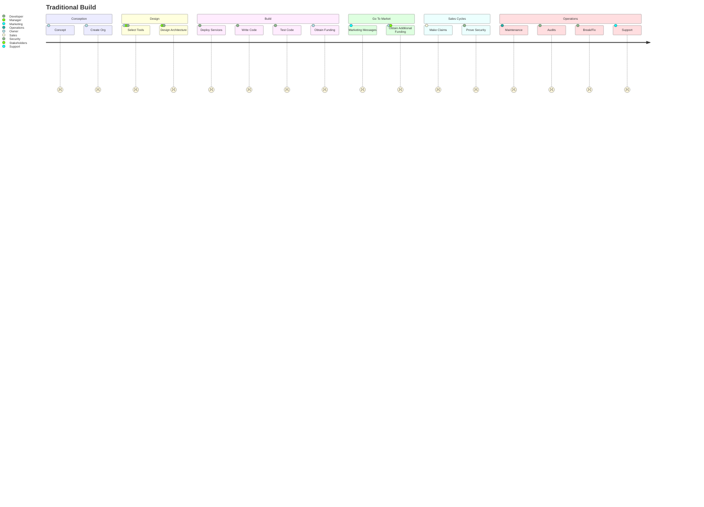
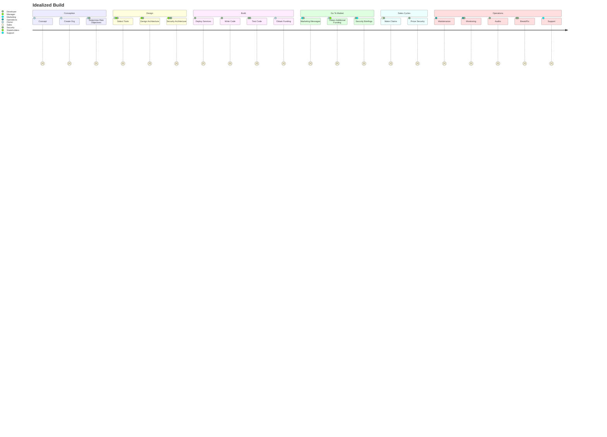

# Everyone is using AI, why not us?

SpecifierOnline is a deterministic system by design. The security, compliance, and governance of a system must be known, verifiable, and have a point of truth.

[Protecting Organizations from Misapplied AI: A Forensic Analysis of Probabilistic vs Deterministic Systems in Operational Use](https://www.linkedin.com/pulse/protecting-organizations-from-misapplied-ai-forensic-analysis-taylor-67kmc/) This article is about AI specifically, but can be generalized to explain why we follow deterministic principles.

---

# System Design Problems

The traditional build process adds security after a working system has been built. It depends upon the experience of the developers and managers as to how security principles are integrated into the product. Developer organizations have security guidelines written and available, but developers tend to skip steps to get the code working, thinking they can go back and clean it up later.

## Traditional Model
Not specifically a documented process, this is an observation of what organizations are actually doing, as opposed to what project managers try to get them to do.

## A Better Model
This should not be construde as a recommended project plan, it only indicates relationships and where security/compliance should be injected into the traditional model.

