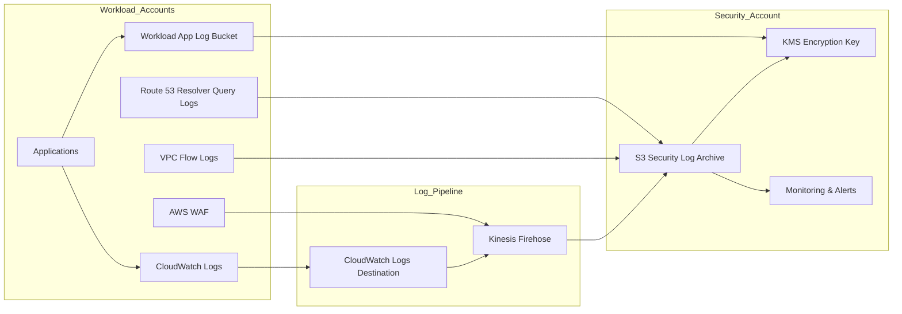

# Centralized Logging Architecture Overview

## Purpose

The environment uses a hybrid logging architecture to ensure that security-relevant events generated across AWS accounts are collected, protected from tampering, and retained for investigation and compliance reporting.

The Security account maintains the centralized security log archive. Workload accounts retain certain operational and application logs locally when centralization is not required, not supported by the AWS service, or not appropriate for data isolation.

The `infrastructure/` directory is canonical for implementation details.

---

# High-Level Architecture



---

# Key Design Elements

### Central Security Log Archive

Security telemetry is delivered to a centralized S3 bucket located in the Security account.

The central archive is configured with:

- Object Lock enabled
- Versioning enabled
- Public access blocked
- Strict bucket policy
- SSE-KMS encryption

The central archive is implemented in:
```
infrastructure/modules/log_archive/
```

---

### Immutable Storage

The central security log archive uses S3 Object Lock Compliance mode.

The current security environment configures:

- Object Lock Compliance mode
- 365-day object lock retention
- 2555-day lifecycle retention
- 2555-day noncurrent version retention

These values are defined in:
```
infrastructure/environments/security/terraform.tfvars
infrastructure/modules/log_archive/
```

Application log storage is separate. The workload onboarding template creates a workload-local application log bucket with Object Lock enabled.

That workload application log bucket is implemented in:
```
cloudformation/workload-account-onboarding.yaml
```

Do not treat all workload-local application logs as centrally archived security telemetry.

---

### Encryption

Security log archive objects are encrypted using AWS KMS.

Encryption protections include:
- TLS encryption for delivery
- SSE-KMS encryption for objects stored in S3
- KMS key policy controls for approved logging services and delivery paths

The central KMS key is implemented in:
```
infrastructure/modules/log_archive/kms.tf
```

The workload-local application log bucket uses its own KMS key created by:
```
cloudformation/workload-account-onboarding.yaml
```

---

### Cross-Account Log Delivery

Cross-account log delivery uses more than one delivery pattern.

Selected CloudWatch log groups use:

```
CloudWatch Logs
→ CloudWatch Logs destination
→ Kinesis Firehose
→ Central security log archive
```
This path is implemented in:
```
infrastructure/modules/log_transport_pipeline/
infrastructure/modules/customer_observability/
cloudformation/workload-account-onboarding.yaml
```

VPC Flow Logs use direct S3 delivery:
```
VPC Flow Logs
→ Central security log archive
```

This path is implemented in:
```
infrastructure/modules/service_logging/vpc_flow_logs.tf
infrastructure/modules/customer_network/
```
Route 53 Resolver query logs also use direct S3 delivery:
```
Route 53 Resolver query logging
→ Central security log archive
```
This path is implemented in:
```
infrastructure/modules/route53_query_logging_shared/
infrastructure/modules/service_logging/route53_logging.tf
```

---

### Log Sources

Security logs originate from multiple layers of the environment.

| Log Source | Delivery Pattern | Current Implementation Status |
| --- | --- | --- |
| CloudTrail | Organization trail to S3; CloudWatch Logs integration for metric filters | Trail is managed out-of-band. CloudWatch log group and delivery role are Terraform-managed. |
| CloudWatch Logs from ECS and Aurora | CloudWatch Logs destination to Firehose to S3 | Defined in customer observability and central log transport modules. |
| VPC Flow Logs | Direct S3 delivery | Defined for platform/service logging and customer network modules. |
| Route 53 Resolver query logs | Direct S3 delivery | Defined through shared query logging module and service logging support. |
| AWS WAF | WAF logging to Firehose to S3 | Defined but inactive when `waf_web_acl_arns = []`. |
| ALB | Workload/service-owned logging, not central security-account logging | Not represented as active security-account ALB logging in current infrastructure. |
| CloudFront | Validation only unless distribution IDs and compatible destination are provided | Not active when `cloudfront_distribution_ids = []`. |
| Application logs | Workload-local application log bucket unless selected log groups are security-relevant | Workload app log bucket is created by onboarding template. Selected ECS/Aurora logs are forwarded centrally. |


---

### Log Pipeline

The log pipeline is not a single path.

The CloudWatch Logs pipeline is:
```
CloudWatch Logs
→ CloudWatch Logs destination
→ Kinesis Firehose
→ Central security log archive
```

The direct service delivery path is:
```
AWS service delivery
→ Central security log archive
```

The workload-local application log path is:
```
Application
→ Workload-local application log bucket
```

This distinction matters for evidence collection. Each log source must be validated against its actual delivery path.

The authoritative delivery model is maintained in:
```
architecture/logging/log-flow-table.md
```


---

### Monitoring and Alerting

The logging architecture is monitored to detect delivery failures, configuration drift, and suspicious changes.

Monitoring includes:
- CloudTrail status monitoring
- S3 bucket policy change detection
- KMS key policy change alerts
- Firehose delivery failure alerts
- VPC Flow Log delivery monitoring
- ECS and Aurora log forwarding checks

Monitoring is implemented through:
```
infrastructure/modules/logging_monitoring/
infrastructure/modules/compliance_validation/
infrastructure/modules/guardduty/
infrastructure/modules/detective/
```

Security alerts are generated through CloudWatch, AWS Config, Security Hub, GuardDuty, Detective, and SNS where configured.

---

# Security Benefits

This architecture supports:
- centralized control of security telemetry
- protected audit records in the Security account
- workload-local isolation for application logs
- independent security review of selected workload events
- delivery-path-specific evidence collection
- stronger separation between operational logs and audit-relevant security telemetry


---

# Compliance Alignment

The logging architecture supports the following security control families:
- AU, Audit and Accountability
- AC, Access Control
- SC, System and Communications Protection
- SI, System and Information Integrity
- CM, Configuration Management
- CA, Security Assessment and Authorization

Representative controls supported by this architecture include:

AU-2 Audit Events  
AU-3 Content of Audit Records  
AU-6 Audit Review  
AU-9 Protection of Audit Information  
AU-11 Audit Retention  
AU-12 Audit Generation  
AC-3 Access Enforcement  
CM-2 Baseline Configuration  
CM-6 Configuration Settings  
SC-12 Cryptographic Key Management  
SC-28 Protection of Information at Rest  
SI-4 System Monitoring  
SI-7 Integrity Protection  


> DEPRECATED: The earlier full-centralization model has been replaced by the current hybrid model. Security telemetry is centralized in the Security account, while some application and service logs remain workload-local or service-owned.
