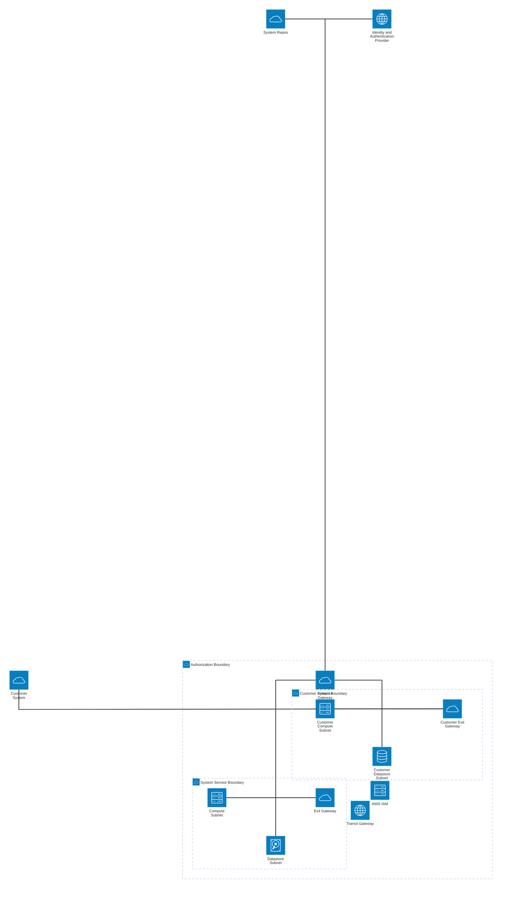

# System Architectural Diagrams

## Design Only

### Segmentation Diagram
The icons in the AB (authorization boundary) only identify **_subnets_**, not devices. Subnetting is core to secure architectural development for compliance.

