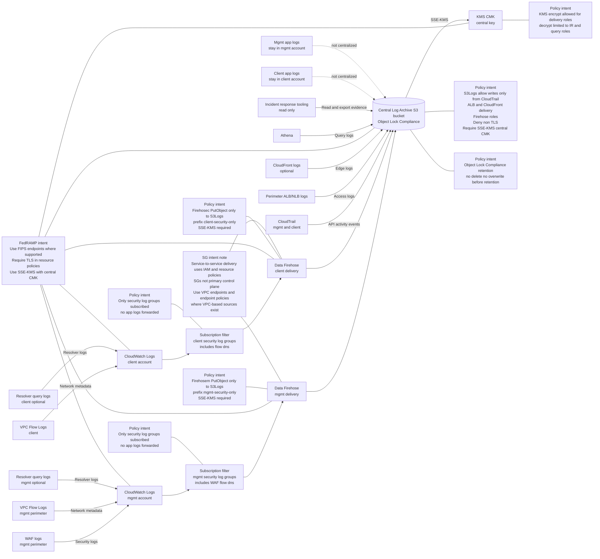
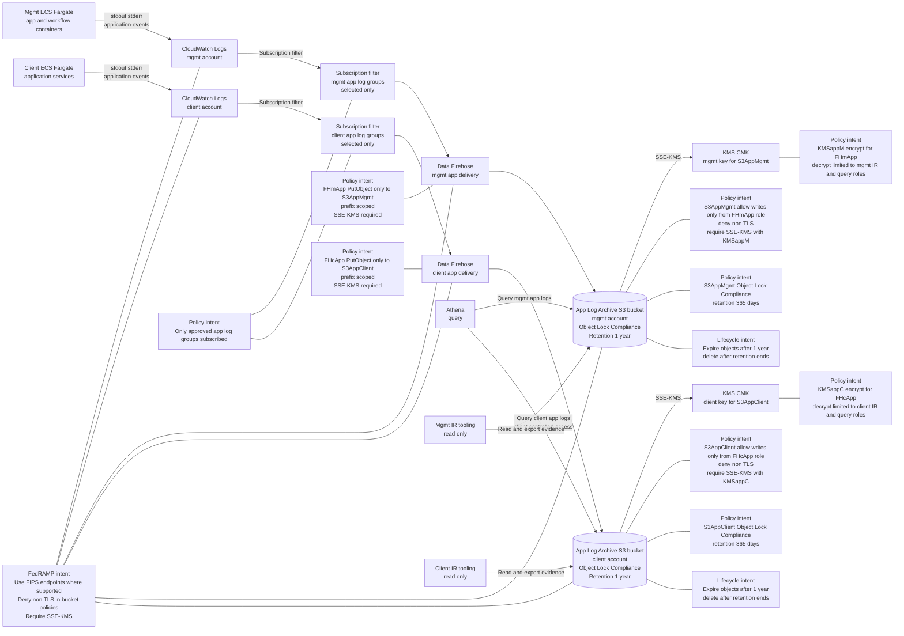
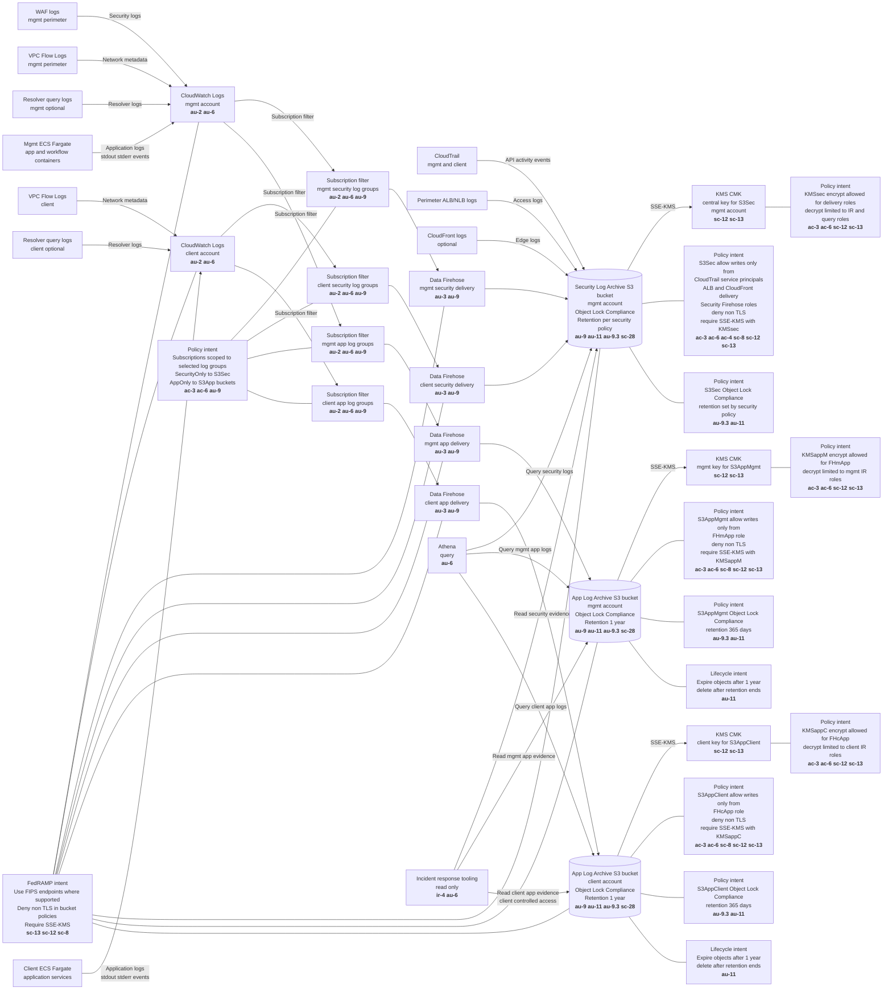

# Centralized security logging diagram with security group and policy intent.
Client application logs remain in the client account.



---

# Application Logging
Separated by account, shorter retention period.



---

# Logging Architecture
Merge of security and application logging



---

# Log Flow Explanation Table

This table explains each data flow shown in the logging architecture diagram.  
Each row corresponds to a log pipeline between a source service and the centralized log archive.

---

| Log Source | Event Type | Transport Mechanism | Intermediate Service | Destination | Encryption | Integrity Protection | Notes |
|---|---|---|---|---|---|---|---|
| AWS CloudTrail | AWS API activity | Native AWS service delivery | None | S3 Security Log Archive | TLS + SSE-KMS | CloudTrail log validation | Captures all API calls across accounts |
| Application Load Balancer | HTTP request access logs | AWS log delivery service | None | S3 Security Log Archive | TLS + SSE-KMS | S3 Object Lock | Used for traffic monitoring and incident investigation |
| CloudFront | Edge access logs | AWS log delivery service | None | S3 Security Log Archive | TLS + SSE-KMS | S3 Object Lock | Logs internet-facing CDN traffic |
| AWS WAF | Web request inspection logs | CloudWatch Logs export | Kinesis Firehose | S3 Security Log Archive | TLS + SSE-KMS | S3 Object Lock | Captures blocked and allowed web traffic |
| Application Services | Application runtime logs | CloudWatch Logs subscription | Kinesis Firehose | S3 Security Log Archive | TLS + SSE-KMS | S3 Object Lock | Includes application security events |
| CloudWatch Logs | Aggregated log streams | Subscription filter | Kinesis Firehose | S3 Security Log Archive | TLS + SSE-KMS | S3 Object Lock | Provides centralized log ingestion pipeline |
| Kinesis Firehose | Buffered log delivery | AWS service streaming | None | S3 Security Log Archive | TLS + SSE-KMS | S3 Object Lock | Provides buffering and batching before S3 storage |

---

# Encryption and Integrity

All log flows enforce encryption and integrity controls:

| Control | Implementation |
|---|---|
| Encryption in Transit | TLS enforced by AWS service endpoints |
| Encryption at Rest | SSE-KMS using centralized security key |
| Log Tamper Protection | S3 Object Lock Compliance Mode |
| Write Restrictions | S3 bucket policy restricts writers |
| Log Validation | CloudTrail file validation |

---

# Log Storage Structure

Logs are stored in the centralized archive using the following structure:

```
central-security-logs/
    AWSLogs/
        <account-id>/
            cloudtrail/
            elasticloadbalancing/
            cloudfront/
            waf/
            application/
```

This structure allows:

- separation of logs by account
- service-based log grouping
- simplified log ingestion into monitoring tools

---

# Security Boundary

The centralized log archive resides in the **Security account**, which is administratively separate from workload accounts.

This architecture ensures:

- workload administrators cannot delete or alter logs
- security teams maintain independent control over audit records
- cross-account log delivery is tightly controlled through IAM policies

---

# Monitoring Coverage

All log delivery pipelines are monitored for operational health.

Monitoring includes:

| Event | Detection Mechanism |
|---|---|
| CloudTrail disabled | CloudWatch alarm |
| Log delivery failure | Firehose error metrics |
| S3 bucket policy changes | AWS Config rule |
| KMS key changes | Security alert |
| Log ingestion anomalies | Security monitoring tools |

---

# Architecture Assurance

The log flow architecture ensures that:

- security events are collected from all infrastructure layers
- logs are encrypted during transport and storage
- log records cannot be modified after delivery
- logs remain available for investigation and compliance review

---

# Application Log Architecture – Auditor Verification Checklist

## 1. Log Generation
- [ ] Application logs are generated in each application account.
- [ ] Logs include security events, authentication events, API activity, and system errors.
- [ ] Logs are written to CloudWatch Logs within the originating account.

## 2. Log Retention in CloudWatch
- [ ] CloudWatch Log Groups have retention configured (recommended 30–90 days).
- [ ] Logs are not stored indefinitely in CloudWatch.
- [ ] Log group naming convention clearly identifies system and environment.

## 3. Log Export
- [ ] CloudWatch Logs subscription filter exports logs to a centralized logging pipeline.
- [ ] Export destination is a Kinesis Firehose delivery stream or Lambda forwarder.

## 4. Cross-Account Logging
- [ ] Logs are written to an immutable S3 bucket in a **separate security account**.
- [ ] Source accounts have **write-only permission** to the logging bucket.
- [ ] Security account owns the S3 bucket and retention configuration.

## 5. Immutable Storage
- [ ] S3 Object Lock is enabled.
- [ ] Mode: **Compliance**
- [ ] Retention period: **1 year**

## 6. Encryption
- [ ] S3 bucket encryption uses **AWS KMS**.
- [ ] KMS keys use **FIPS-validated cryptography** where required.
- [ ] Key access policies restrict modification to the security account.

## 7. Access Control
- [ ] Application accounts cannot delete or overwrite logs.
- [ ] Security team has read access.
- [ ] Administrative changes require privileged IAM roles.

## 8. Log Integrity
- [ ] S3 Object Lock prevents deletion or modification during the retention period.
- [ ] Bucket versioning enabled.
- [ ] CloudTrail logs access to the logging bucket.

## 9. Retention and Deletion
- [ ] Logs are retained immutably for **1 year**.
- [ ] Lifecycle policies remove logs after the retention period expires.

## 10. Monitoring
- [ ] Logging pipeline health monitored via CloudWatch metrics.
- [ ] Alerts configured for delivery failures.
- [ ] Security team notified if log export fails.

---


# Cross-Account Security Logging Architecture  
### Auditor Implementation Checklist

Purpose: Centralize security logging across AWS accounts with encryption, immutability, and controlled access.

Security logs are delivered from workload accounts into a **central Security account S3 bucket** configured for tamper resistance and long-term retention.

---

# 1. Central Security Log Archive

## Control Mapping
AU-9  
AU-11  
SC-28  
SI-7

## Implementation

A dedicated S3 bucket in the Security account stores all security logs.

Configuration:

- Bucket name: `central-security-logs`
- Versioning: Enabled
- Object Lock: Enabled
- Object Lock mode: **Compliance**
- Retention: **365 days minimum**
- Public access: Blocked
- Cross-account writes allowed only for logging services

## Evidence Artifact

- S3 bucket configuration export
- Object Lock configuration
- Bucket policy
- Lifecycle policy

## Verification

```
aws s3api get-bucket-versioning --bucket central-security-logs
aws s3api get-object-lock-configuration --bucket central-security-logs
aws s3api get-public-access-block --bucket central-security-logs
```

## Responsible Role

Security Engineering

---

# 2. Encryption with AWS KMS

## Control Mapping

SC-12  
SC-13  
IA-7  
SC-28

## Implementation

All log objects are encrypted using **SSE-KMS** with a centralized key.

Key alias:

```
alias/security-log-key
```

Key configuration:

- Automatic rotation enabled
- Key access restricted to logging services
- Cross-account encryption allowed

## Evidence Artifact

- KMS key policy
- Key rotation configuration
- Encryption configuration

## Verification

```
aws kms describe-key --key-id alias/security-log-key
aws s3api get-bucket-encryption --bucket central-security-logs
```

## Responsible Role

Security Engineering

---

# 3. Cross-Account Bucket Policy

## Control Mapping

AC-3  
AC-6  
SC-7  
SC-12

## Implementation

The log archive bucket only accepts writes from approved AWS logging services.

Allowed services:

| Service | Log Type |
|---|---|
| CloudTrail | API activity |
| ALB | Application access logs |
| CloudFront | Edge logs |
| WAF | Firewall events |
| CloudWatch Logs | Application logs |

Security restrictions:

- TLS required
- SSE-KMS required
- Approved KMS key required
- Unencrypted uploads denied

## Evidence Artifact

- S3 bucket policy
- IAM policy review

## Verification

```
aws s3api get-bucket-policy --bucket central-security-logs
```

## Responsible Role

Security Engineering

---

# 4. CloudTrail Logging

## Control Mapping

AU-2  
AU-12  
AU-10

## Implementation

CloudTrail records AWS API activity across all accounts.

Configuration:

```
Multi-region trail: enabled
Log validation: enabled
Destination bucket: central-security-logs
Encryption: SSE-KMS
```

## Evidence Artifact

- CloudTrail configuration
- Log file validation records
- Trail status output

## Verification

```
aws cloudtrail get-trail-status
aws cloudtrail describe-trails
```

## Responsible Role

Cloud Platform Team

---

# 5. Application Load Balancer Logs

## Control Mapping

AU-2  
AU-12

## Implementation

All Application Load Balancers are configured to deliver access logs.

Configuration:

```
Access Logs: enabled
Bucket: central-security-logs
Prefix: AWSLogs/<account-id>/elasticloadbalancing
```

## Evidence Artifact

- ALB configuration export
- Example access log file

## Verification

```
aws elbv2 describe-load-balancers
```

## Responsible Role

Cloud Platform Team

---

# 6. CloudFront Logs

## Control Mapping

AU-2  
AU-12

## Implementation

CloudFront distributions deliver standard access logs to the central log archive.

Configuration:

```
Bucket: central-security-logs
Prefix: AWSLogs/<account-id>/cloudfront
```

## Evidence Artifact

- Distribution configuration
- Example log files

## Verification

```
aws cloudfront get-distribution-config --id <distribution-id>
```

## Responsible Role

Cloud Platform Team

---

# 7. WAF Logging

## Control Mapping

AU-12  
SI-4

## Implementation

WAF events are delivered through CloudWatch Logs and exported to S3.

Architecture:

```
AWS WAF
 ↓
CloudWatch Logs
 ↓
Kinesis Firehose
 ↓
central-security-logs
```

## Evidence Artifact

- WAF logging configuration
- Firehose configuration
- Log group settings

## Verification

```
aws wafv2 get-logging-configuration
```

## Responsible Role

Security Engineering

---

# 8. Application Logs (CloudWatch)

## Control Mapping

AU-3  
AU-6  
SI-4

## Implementation

Application logs are stored in CloudWatch Logs and replicated to the security account.

Architecture:

```
Application
 ↓
CloudWatch Logs
 ↓
Subscription Filter
 ↓
Kinesis Firehose
 ↓
central-security-logs
```

## Evidence Artifact

- Log group configuration
- Subscription filters
- Firehose stream configuration

## Verification

```
aws logs describe-log-groups
aws logs describe-subscription-filters
```

## Responsible Role

Platform Engineering

---

# 9. Log Retention Policy

## Control Mapping

AU-11  
AU-9

## Implementation

Log lifecycle rules manage long-term storage.

Example lifecycle:

```
0–365 days → S3 Standard
365–730 days → Glacier
>730 days → Delete (optional)
```

Object Lock ensures logs remain immutable during retention.

## Evidence Artifact

- S3 lifecycle policy
- Object lock retention configuration

## Verification

```
aws s3api get-bucket-lifecycle-configuration --bucket central-security-logs
```

## Responsible Role

Security Engineering

---

# 10. Monitoring and Alerting

## Control Mapping

AU-5  
SI-4

## Implementation

Security monitoring alerts on logging failures and configuration changes.

Alert conditions:

| Event | Response |
|---|---|
| CloudTrail disabled | Critical alert |
| Bucket policy modified | Security alert |
| KMS key policy change | Security alert |
| Log delivery failure | Pager alert |

Monitoring tools:

- AWS CloudWatch
- AWS Security Hub
- AWS GuardDuty
- AWS Config

## Evidence Artifact

- CloudWatch alarms
- Config rules
- Security Hub findings

## Verification

```
aws cloudwatch describe-alarms
aws configservice describe-config-rules
```

## Responsible Role

Security Operations

---

# Architecture Assurance Summary

This logging architecture ensures:

- Centralized audit logging
- Immutable log storage
- Cross-account log delivery
- Encryption with KMS
- Minimum 1-year retention
- Monitoring of logging failures

Mapped controls:

```
AU-2
AU-3
AU-5
AU-6
AU-9
AU-10
AU-11
AU-12
AC-3
AC-6
SC-7
SC-12
SC-13
SC-28
SI-4
SI-7
```
