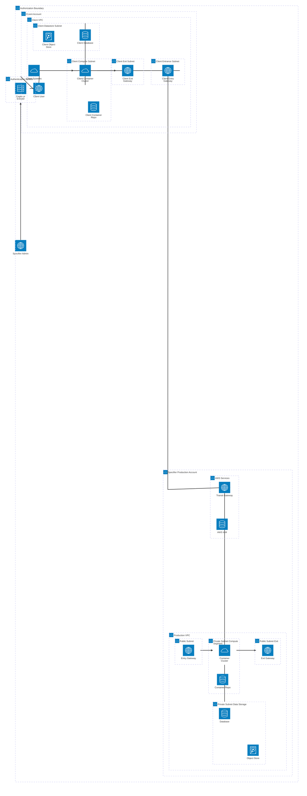

```mermaid
architecture-beta
    
    %% Authorization Boundary
    group auth_boundary(cloud)[Authorization Boundary]

        %% Specifier Account
        group master_account(cloud)[Specifier Production Account] in auth_boundary

            %% Production VPC
            group master_vpc(cloud)[Production VPC] in master_account

            %% Public Subnet - Entrance Gateway
            group master_public_entry(cloud)[Public Subnet] in master_vpc
                service entry_gw(internet)[Entry Gateway] in master_public_entry
            
            %% Public Subnet - Exit Gateway
            group master_public_exit(cloud)[Public Subnet Exit] in master_vpc
                service exit_gw(internet)[Exit Gateway] in master_public_exit

            %% Private Subnet - Compute
            group master_compute_subnet(cloud)[Private Subnet Compute Segment] in master_vpc
                service container_cluster(cloud)[Container Cluster] in master_compute_subnet
                service repo(database)[Container Repo] in master_compute_subnet
            
            %% Private Subnet - Datastore
            group master_data_subnet(cloud)[Private Subnet Data Storage] in master_vpc
                service db(database)[Database] in master_data_subnet
                service s3(disk)[Object Store] in master_data_subnet
            
            %% Connections within master
            entry_gw{group}:R --> L:container_cluster{group}
            container_cluster{group}:B -- T:db{group}
            container_cluster{group}:R --> L:exit_gw{group}

        %% Client Account
        group client_account(cloud)[CLient Account] in auth_boundary

            %% Client VPC
            group client_vpc(cloud)[Client VPC] in client_account

                %% Client Public Subnet - Entrance Gateway
                group client_public_entry(cloud)[Client Entrance Subnet] in client_vpc
                    service client_entry_gw(internet)[Client Entry Gateway] in client_public_entry
                
                %% Client Public Subnet - Exit Gateway
                group client_public_exit(cloud)[Client Exit Subnet] in client_vpc
                    service client_exit_gw(internet)[Client Exit Gateway] in client_public_exit
                
                %% Private Subnet - Compute Segment
                group client_compute_subnet(cloud)[Client Compute Subnet] in client_vpc
                    service client_compute_cluster(cloud)[Client Container Cluster] in client_compute_subnet
                    service client_repo(database)[Client Container Repo] in client_compute_subnet
                
                %% Private Subnet - Datastore
                group client_data_subnet(cloud)[Client Datastore Subnet] in client_vpc
                    service client_db(database)[Client Database] in client_data_subnet
                    service client_s3(disk)[Client Object Store] in client_data_subnet
                
                %% Connections within client
                client_entry_gw{group}:R --> L:client_compute_cluster{group}
                client_compute_cluster{group}:B -- T:client_db{group}
                client_compute_cluster{group}:R --> L:client_exit_gw{group}

            %% AWS Service
            group aws_service(cloud)[AWS Services] in master_account
                service iam(database)[AWS IAM] in aws_service
                service transit_gw(internet)[Transit Gateway] in aws_service

        %% External Services
        group external_auth(cloud)[Authentication Service]
            service auth_service(server)[Cogito or EntraID] in external_auth
            service admin_user(internet)[Specifier Admin]
            service client_user(internet)[Client User]
            service client_systems(cloud)[Client Systems]
        
        %% External Authentication Traffic
        junction auth_junction
        admin_user:T --> B:auth_service{group}
        client_user:L --> R:auth_service{group}
        auth_service{group}:T -- R:auth_junction
        %%auth_junction:R --> L:entry_gw{group}
        %%iam:L -- T:auth_junction
        %%auth_service{group}:R --> T:client_entry_gw

        %% External System Traffic
        client_exit_gw{group}:R -- L:client_systems

        %% Management Traffic
        container_cluster:T -- B:transit_gw
        transit_gw:R -- T:client_entry_gw
```
Traffic Jacks up the drawing.
