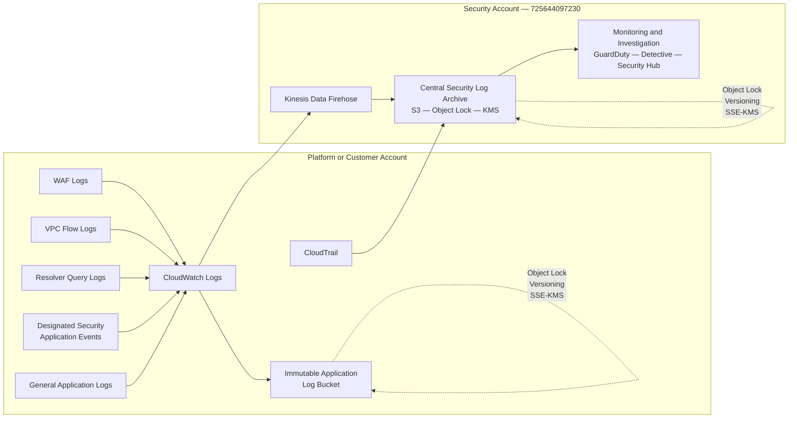

# Centralized Logging Architecture

> **Narrative:** `architecture/logging/narrative.md`
> **Node taxonomy:** `architecture/diagrams/diagram-node-taxonomy.md`

---

## Log routing summary

| Log source | Destination | Path |
|---|---|---|
| CloudTrail | Security log archive | Direct S3 delivery |
| VPC Flow Logs | Security log archive | CloudWatch Logs → Firehose → S3 |
| Route53 Resolver | Security log archive | CloudWatch Logs → Firehose → S3 |
| WAF logs | Security log archive | CloudWatch Logs → Firehose → S3 |
| Security app events | Security log archive | CloudWatch Logs → Firehose → S3 |
| General app logs | Customer app log bucket | CloudWatch Logs → S3 (local account) |

Security logs route to the central archive. Application logs stay local
to the account for cost efficiency and data sovereignty.

---

## Terraform Resource Map

| Node ID | Diagram label | Terraform resource | Module |
|---|---|---|---|
| `SEC_LOG_ARCHIVE` | Central Security Log Archive | `aws_s3_bucket.security_log_archive` | `security/log_archive` |
| `SEC_KMS` | KMS key | `aws_kms_key.log_archive` | `security/log_archive` |
| `SEC_FIREHOSE` | Kinesis Data Firehose | `aws_kinesis_firehose_delivery_stream.security` | `security/log_transport_pipeline` |
| `SEC_CLOUDTRAIL` | CloudTrail | CLI-managed — see deploy-security-environment.md | `security` |
| `SEC_GUARDDUTY` | GuardDuty | `aws_guardduty_detector.security` | `security/guardduty` |
| `SEC_DETECTIVE` | Detective | `aws_detective_graph.security` | `security/detective` |
| `SEC_SECURITYHUB` | Security Hub | `aws_securityhub_account.security` | `security/compliance_validation` |

---

## Related Documents

- `architecture/logging/narrative.md` — detailed architecture explanation
- `architecture/logging/log-flow-table.md` — authoritative log source definitions
- `diagrams/log-delivery-trust-model.md` — cross-account delivery permissions
- `architecture/diagrams/diagram-node-taxonomy.md` — canonical node ID registry
