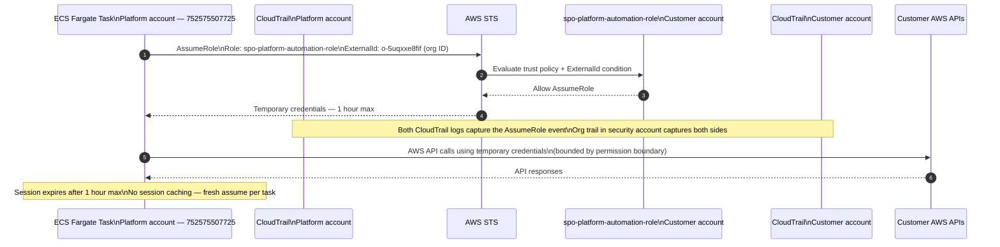
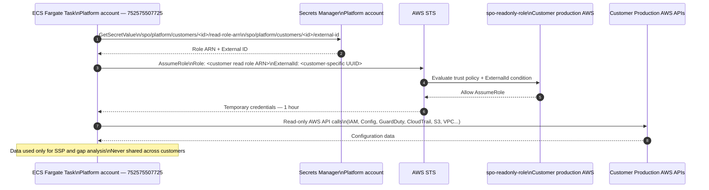
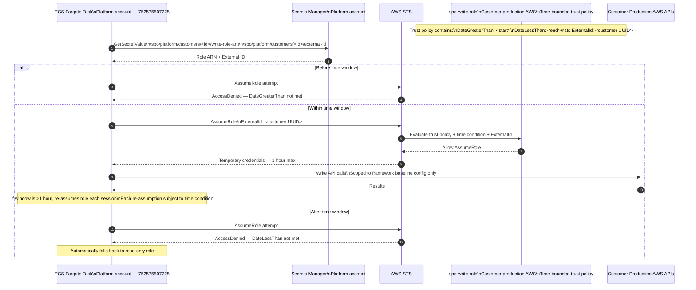

# Cross-Account Access Flow

> **Architecture reference:** `architecture/platform/cross-account-access-model.md`
> **Node taxonomy:** `architecture/diagrams/diagram-node-taxonomy.md`

This document shows the IAM role assumption sequences for the two cross-account
access patterns used by SpecifierOnline. See
`architecture/platform/cross-account-access-model.md` for the full design
rationale and compliance mapping.

---

# Pattern 1 — Platform automation into customer accounts

Platform ECS tasks assume `spo-platform-automation-role` in each customer
account to perform lifecycle operations (provisioning, updates, redeployment).

---

# Pattern 2A — Read-only access to customer production AWS

SpecifierOnline reads live configuration from the customer's own production
AWS environment for continuous compliance verification.

---

# Pattern 2B — Write access to customer production AWS (time-bounded)

Optional, customer-elected. SpecifierOnline writes baseline configuration
during a customer-defined time window. After the window closes, the role
trust policy prevents further assumption.

---

## Terraform Resource Map

| Node ID | Diagram label | Terraform resource | Module |
|---|---|---|---|
| `COMPUTE_ECS_TASKS` | ECS Fargate Task — Platform | `aws_ecs_cluster.platform` | `ecs_cluster` |
| `CA_BOOTSTRAP_ROLE` | spo-platform-automation-role | CloudFormation StackSet | `cloudformation/workload-account-onboarding.yaml` |
| `SEC_CLOUDTRAIL` | CloudTrail org trail | CLI-managed | `security` |

---

## Related Documents

- `architecture/platform/cross-account-access-model.md` — full design rationale
- `architecture/diagrams/diagram-node-taxonomy.md` — canonical node ID registry
- `diagrams/system-boundary.md` — organization boundary
- `diagrams/dataflows.md` — data flow context
