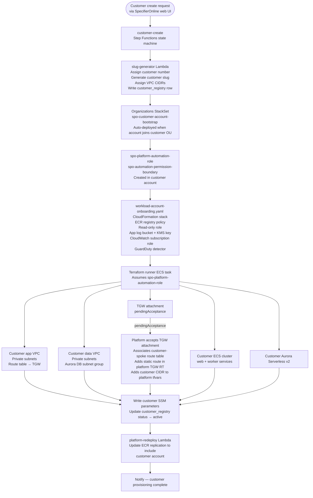

# Customer Account Factory

> **Runbook:** `procedures/provision-customer-account.md`
> **Architecture reference:** `procedures/workload-account-onboarding-runbook.md`
> **Node taxonomy:** `architecture/diagrams/diagram-node-taxonomy.md`

This diagram shows the automated customer account provisioning sequence driven
by the `customer-create` Step Functions state machine.

---

# Customer provisioning flow

---

## Provisioning phases

| Phase | What happens | Automated by |
|---|---|---|
| 1 — Identity | Assign customer number, slug, VPC CIDRs; write `customer_registry` row | slug-generator Lambda |
| 2 — Bootstrap | `spo-platform-automation-role` + permission boundary created | Organizations StackSet auto-deploy |
| 3 — Onboarding stack | ECR policy, read-only role, app log bucket, GuardDuty detector | Step Functions → CloudFormation |
| 4 — Terraform | VPCs, ECS, Aurora, TGW attachment, SSM params | Step Functions → Terraform runner ECS task |
| 5 — TGW acceptance | Accept attachment, associate route table, add static route | Step Functions → platform API calls |
| 6 — Post-apply | Update SSM, activate customer registry row, update ECR replication | Step Functions → Lambda |

---

## Terraform Resource Map

| Node ID | Diagram label | Terraform resource | Module |
|---|---|---|---|
| `CA_BOOTSTRAP_ROLE` | spo-platform-automation-role | CloudFormation StackSet | `cloudformation/workload-account-onboarding.yaml` |
| `CA_APP_VPC` | Customer app VPC | `aws_vpc.app` | `customer_network` |
| `CA_DATA_VPC` | Customer data VPC | `aws_vpc.data` | `customer_network` |
| `CA_TGW_ATTACH` | TGW attachment | `aws_ec2_transit_gateway_vpc_attachment.app` | `customer_network` |
| `CA_ECS_CLUSTER` | Customer ECS cluster | `aws_ecs_cluster.customer` | `customer_ecs` |
| `CA_AURORA` | Customer Aurora | `aws_rds_cluster.customer` | `customer_data` |
| `PLAT_TGW` | Transit Gateway | `aws_ec2_transit_gateway.platform` | `transit_gateway` |

---

## Related Documents

- `procedures/provision-customer-account.md` — full step-by-step manual procedure
- `procedures/workload-account-onboarding-runbook.md` — architecture overview
- `architecture/diagrams/diagram-node-taxonomy.md` — canonical node ID registry
- `diagrams/system-boundary.md` — organization boundary context
