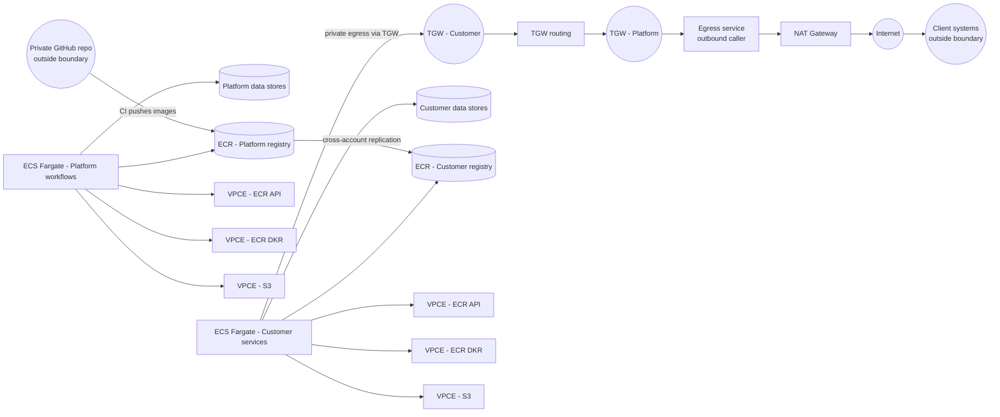

# Data Flows

> **Account reference:** `architecture/platform/account-structure.md`
> **Network topology:** `diagrams/platform-account-network.md`
> **Node taxonomy:** `architecture/diagrams/diagram-node-taxonomy.md`

This document shows data flows through the SpecifierOnline system organized
by flow type. Each diagram focuses on one flow category with explicit payload
labels showing what data crosses each boundary.

---

# Main dataflow overview

```mermaid
flowchart LR
  %% External actors and systems
  %% spo:diagram-node = EXT_INTERNET (via ClientUser)
  ClientUser[Client user]
  Admin[Admin]
  Internet((Internet))
  %% spo:diagram-node = EXT_CUSTOMER_SSO
  CustomerIdP((Customer SSO IdP\nSAML or OIDC))
  %% spo:diagram-node = EXT_GITHUB_CI
  GitHubExt((Private GitHub repo\noutside boundary))
  %% spo:diagram-node = EXT_CLIENT_SYSTEMS
  ClientSystems((Client systems\noutside boundary))

  %% Edge and perimeter
  %% spo:diagram-node = PLAT_CF
  CF[CloudFront]
  %% spo:diagram-node = PLAT_WAF
  WAF[WAF]
  %% spo:diagram-node = PERIM_NLB
  NLB[NLB]
  %% spo:diagram-node = PERIM_ALB
  ALB_Perim[ALB - Perimeter]
  %% spo:diagram-node = PERIM_INGRESS
  Ingress[Ingress service\nSSO + session + routing]
  %% spo:diagram-node = PERIM_EGRESS
  EgressSvc[Egress service\noutbound caller]
  %% spo:diagram-node = PERIM_NAT
  NAT[NAT Gateway]

  %% Network backbone
  %% spo:diagram-node = PLAT_TGW
  TGW_P((TGW - Platform))
  TGW_Peer[TGW routing]
  %% spo:diagram-node = CA_TGW_ATTACH
  TGW_C((TGW - Customer))

  %% Platform account compute and data
  %% spo:diagram-node = COMPUTE_ECS_TASKS
  PlatECS[ECS Fargate - Platform workflows]
  %% spo:diagram-node = DATA_AURORA
  PlatData[(Platform data stores\nAurora - customer registry)]
  %% spo:diagram-node = PLAT_ECR
  PlatECR[(ECR - Platform registry)]
  %% spo:diagram-node = COMPUTE_EP_ECR_API
  PlatECRAPI[VPCE - ECR API]
  %% spo:diagram-node = COMPUTE_EP_ECR_DKR
  PlatECRDKR[VPCE - ECR DKR]
  %% spo:diagram-node = COMPUTE_EP_S3
  PlatS3[VPCE - S3]

  %% Customer account compute and data
  ClientALB[ALB - Customer internal]
  %% spo:diagram-node = CA_ECS_CLUSTER
  ClientECS[ECS Fargate - Customer services]
  %% spo:diagram-node = CA_AURORA
  ClientData[(Customer data stores)]
  %% spo:diagram-node = CA_ECR
  ClientECR[(ECR - Customer registry)]
  %% spo:diagram-node = CA_ECR (endpoint)
  ClientECRAPI[VPCE - ECR API]
  ClientECRDKR[VPCE - ECR DKR]
  ClientS3[VPCE - S3]

  %% Flow 1: Client user request and data access
  ClientUser --> Internet --> CF --> WAF --> NLB --> ALB_Perim --> Ingress
  Ingress -->|SSO redirect| CustomerIdP
  CustomerIdP -->|SAMLResponse or OIDC tokens\nincludes MFA evidence| Ingress
  Ingress -->|private request| TGW_P --> TGW_Peer --> TGW_C --> ClientALB --> ClientECS --> ClientData

  %% Flow 2: Client outbound API calls via centralized egress
  ClientECS -->|private egress to perimeter| TGW_C --> TGW_Peer --> TGW_P --> EgressSvc --> NAT --> Internet --> ClientSystems

  %% Flow 3: Admin triggers platform workflow into customer account
  Admin --> Internet --> CF --> WAF --> Ingress --> PlatECS
  PlatECS -->|assume role into customer account\ncontrol plane calls| TGW_P --> TGW_Peer --> TGW_C --> ClientECS

  %% Flow 4: Container image supply chain and pulls
  GitHubExt -->|CI pushes images| PlatECR
  PlatECR -->|cross-account replication| ClientECR

  PlatECS --> PlatECRAPI
  PlatECS --> PlatECRDKR
  PlatECS --> PlatS3
  PlatECS --> PlatECR

  ClientECS --> ClientECRAPI
  ClientECS --> ClientECRDKR
  ClientECS --> ClientS3
  ClientECS --> ClientECR

  %% Flow 5: Logging and artifacts
  PlatECS --> PlatData
  ClientECS --> ClientData
```

---

# Egress and supply-chain flows

---

# User-facing request path and auth context propagation

```mermaid
flowchart LR
  ClientUser[Client user]
  Internet((Internet))
  %% spo:diagram-node = EXT_CUSTOMER_SSO
  CustomerIdP((Customer SSO IdP\nSAML or OIDC))
  %% spo:diagram-node = PLAT_CF
  CF[CloudFront]
  %% spo:diagram-node = PLAT_WAF
  WAF[WAF]
  %% spo:diagram-node = PERIM_NLB
  NLB[NLB]
  %% spo:diagram-node = PERIM_ALB
  ALB_Perim[ALB - Perimeter]
  %% spo:diagram-node = PERIM_INGRESS
  Ingress[Ingress service\nSSO + session + routing]

  %% spo:diagram-node = PLAT_TGW
  TGW_P((TGW - Platform))
  TGW_Peer[TGW routing]
  %% spo:diagram-node = CA_TGW_ATTACH
  TGW_C((TGW - Customer))

  ClientALB[ALB - Customer internal]
  %% spo:diagram-node = CA_ECS_CLUSTER
  ClientECS[Client ECS Fargate\napplication services]
  %% spo:diagram-node = CA_AURORA
  ClientData[(Client data stores)]

  %% Request path with payload labeling
  ClientUser -->|HTTPS request\nURL headers cookies| Internet
  Internet -->|HTTPS| CF
  CF -->|HTTPS origin request| WAF
  WAF -->|Allowed request| NLB
  NLB -->|TCP or TLS pass-through| ALB_Perim
  ALB_Perim -->|HTTPS request| Ingress

  %% SSO and MFA evidence
  Ingress -->|Redirect\nSAML AuthnRequest or OIDC auth request\nincludes MFA required policy| CustomerIdP
  CustomerIdP -->|Auth response\nSAMLResponse or OIDC tokens\nincludes MFA evidence| Ingress

  %% Validation and session minting
  Ingress -->|Validate signature issuer audience time bounds\nValidate MFA evidence\nAnti-replay state tracking| Ingress
  Ingress -->|Set session cookie\nSecure HttpOnly SameSite| ClientUser

  %% Private application traffic to client
  Ingress -->|Private HTTPS request\nSession cookie forwarded or token bound to session| TGW_P
  TGW_P -->|Routed packets\nVPC CIDR to CIDR| TGW_Peer
  TGW_Peer -->|Routed packets| TGW_C
  TGW_C -->|Private HTTPS| ClientALB
  ClientALB -->|HTTPS to targets\nRequest context| ClientECS
  ClientECS -->|DB queries and object access\nPII and customer data| ClientData
```

---

## Terraform Resource Map

| Node ID | Diagram label | Terraform resource | Module |
|---|---|---|---|
| `PLAT_CF` | CloudFront | Not yet deployed | — |
| `PLAT_WAF` | WAF | Not yet deployed | — |
| `PERIM_NLB` | NLB | Not yet deployed | — |
| `PERIM_ALB` | ALB — Perimeter | Not yet deployed | — |
| `PERIM_INGRESS` | Ingress service | Not yet deployed | — |
| `PERIM_EGRESS` | Egress service | Not yet deployed | — |
| `PERIM_NAT` | NAT Gateway | `aws_nat_gateway.perimeter[*]` | `network` |
| `PLAT_TGW` | TGW — Platform | `aws_ec2_transit_gateway.platform` | `transit_gateway` |
| `COMPUTE_ECS_TASKS` | ECS Fargate — Platform | `aws_ecs_cluster.platform` | `ecs_cluster` |
| `DATA_AURORA` | Platform data stores | `aws_rds_cluster.platform` | `aurora` |
| `PLAT_ECR` | ECR — Platform registry | `aws_ecr_repository.*` | `ecr` |
| `COMPUTE_EP_ECR_API` | VPCE — ECR API | `aws_vpc_endpoint.compute_interface["ecr.api"]` | `network` |
| `COMPUTE_EP_ECR_DKR` | VPCE — ECR DKR | `aws_vpc_endpoint.compute_interface["ecr.dkr"]` | `network` |
| `COMPUTE_EP_S3` | VPCE — S3 | `aws_vpc_endpoint.compute_s3` | `network` |
| `CA_TGW_ATTACH` | TGW — Customer | `aws_ec2_transit_gateway_vpc_attachment.app` | `customer_network` |
| `CA_ECS_CLUSTER` | ECS Fargate — Customer | `aws_ecs_cluster.customer` | `customer_ecs` |
| `CA_AURORA` | Customer data stores | `aws_rds_cluster.customer` | `customer_data` |
| `CA_ECR` | ECR — Customer registry | ECR cross-account replication | `ecr` |

---

## Related Documents

- `diagrams/platform-account-network.md` — detailed platform account VPC topology
- `diagrams/network-overview.md` — high-level network overview
- `architecture/platform/cross-account-access-model.md` — IAM role assumption detail
- `architecture/diagrams/diagram-node-taxonomy.md` — canonical node ID registry
