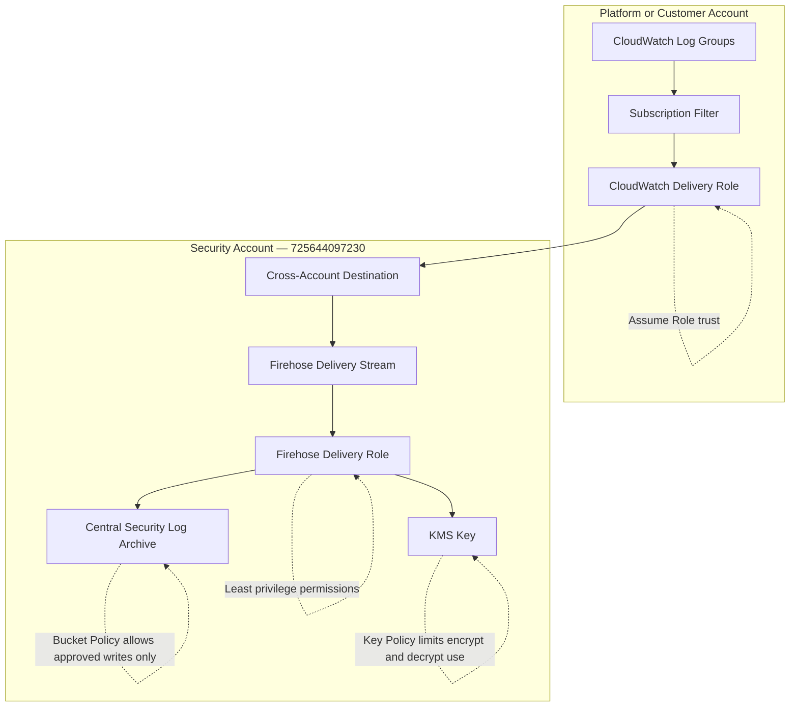

# Log Delivery Trust Model

> **Architecture reference:** `architecture/logging/narrative.md`
> **Node taxonomy:** `architecture/diagrams/diagram-node-taxonomy.md`

---

## Trust chain

Each hop in the delivery pipeline has explicit trust grants:

| From | To | Trust mechanism |
|---|---|---|
| CloudWatch Logs | Cross-account destination | Subscription filter + CloudWatch delivery role |
| CloudWatch delivery role | Security account destination | IAM role trust policy — `logs.amazonaws.com` principal |
| Firehose | S3 log archive | IAM role + S3 bucket policy |
| Firehose | KMS key | KMS key policy — `firehose.amazonaws.com` principal |
| S3 bucket | Object Lock | AWS-enforced — no IAM can override |

---

## Terraform Resource Map

| Node ID | Diagram label | Terraform resource | Module |
|---|---|---|---|
| `SEC_CWL_DEST` | Cross-Account Destination | `aws_cloudwatch_log_destination.central` | `security/log_transport_pipeline` |
| `SEC_FIREHOSE` | Firehose Delivery Stream | `aws_kinesis_firehose_delivery_stream.security` | `security/log_transport_pipeline` |
| `SEC_LOG_ARCHIVE` | Central Security Log Archive | `aws_s3_bucket.security_log_archive` | `security/log_archive` |
| `SEC_KMS` | KMS Key | `aws_kms_key.log_archive` | `security/log_archive` |
| `COMPUTE_EP_LOGS` | CloudWatch Logs endpoint (platform) | `aws_vpc_endpoint.compute_interface["logs"]` | `platform/network` |
| `CA_LOG_GROUP` | CloudWatch Log Groups (customer) | `aws_cloudwatch_log_group.*` | `customer_observability` |

---

## Related Documents

- `architecture/logging/narrative.md` — full delivery architecture
- `diagrams/centralized-logging-architecture.md` — overall logging flow
- `architecture/diagrams/diagram-node-taxonomy.md` — canonical node ID registry
