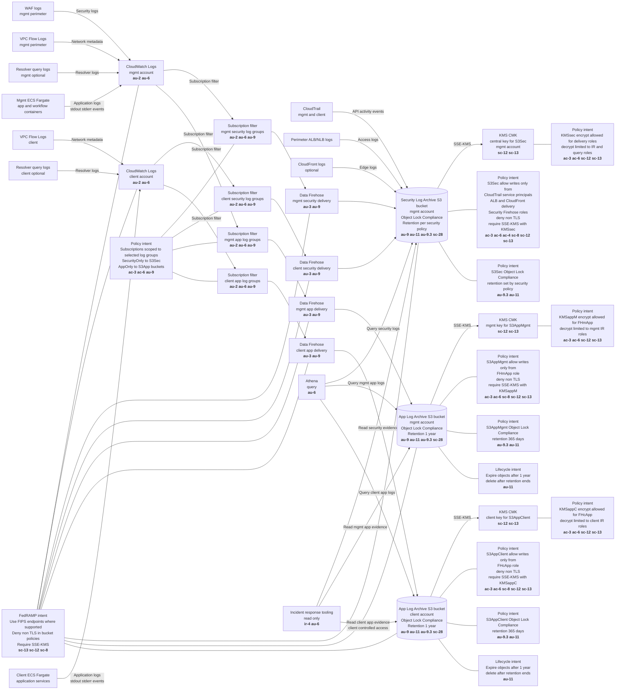

```mermaid
flowchart LR
  %% ================= Producers =================
  MgmtECS[Mgmt ECS Fargate<br>app and workflow containers]
  ClientECS[Client ECS Fargate<br>application services]

  WAFm[WAF logs<br>mgmt perimeter]
  VPCFlowm[VPC Flow Logs<br>mgmt perimeter]
  DNSm[Resolver query logs<br>mgmt optional]

  VPCFlowc[VPC Flow Logs<br>client]
  DNSc[Resolver query logs<br>client optional]

  Trail[CloudTrail<br>mgmt and client]
  PerimALB[Perimeter ALB/NLB logs]
  CF[CloudFront logs<br>optional]

  %% ================= CloudWatch Logs (per-account) =================
  CWLm[CloudWatch Logs<br>mgmt account<br><b>au-2 au-6</b>]
  CWLc[CloudWatch Logs<br>client account<br><b>au-2 au-6</b>]

  %% ================= Subscriptions and delivery =================
  SubmSec[Subscription filter<br>mgmt security log groups<br><b>au-2 au-6 au-9</b>]
  SubcSec[Subscription filter<br>client security log groups<br><b>au-2 au-6 au-9</b>]
  SubmApp[Subscription filter<br>mgmt app log groups<br><b>au-2 au-6 au-9</b>]
  SubcApp[Subscription filter<br>client app log groups<br><b>au-2 au-6 au-9</b>]

  FHmSec[Data Firehose<br>mgmt security delivery<br><b>au-3 au-9</b>]
  FHcSec[Data Firehose<br>client security delivery<br><b>au-3 au-9</b>]
  FHmApp[Data Firehose<br>mgmt app delivery<br><b>au-3 au-9</b>]
  FHcApp[Data Firehose<br>client app delivery<br><b>au-3 au-9</b>]

  %% ================= Immutable archives =================
  S3Sec[(Security Log Archive S3 bucket<br>mgmt account<br>Object Lock Compliance<br>Retention per security policy<br><b>au-9 au-11 au-9.3 sc-28</b>)]

  S3AppMgmt[(App Log Archive S3 bucket<br>mgmt account<br>Object Lock Compliance<br>Retention 1 year<br><b>au-9 au-11 au-9.3 sc-28</b>)]
  S3AppClient[(App Log Archive S3 bucket<br>client account<br>Object Lock Compliance<br>Retention 1 year<br><b>au-9 au-11 au-9.3 sc-28</b>)]

  KMSsec[KMS CMK<br>central key for S3Sec<br>mgmt account<br><b>sc-12 sc-13</b>]
  KMSappM[KMS CMK<br>mgmt key for S3AppMgmt<br><b>sc-12 sc-13</b>]
  KMSappC[KMS CMK<br>client key for S3AppClient<br><b>sc-12 sc-13</b>]

  %% ================= Consumers =================
  Athena[Athena<br>query<br><b>au-6</b>]
  IR[Incident response tooling<br>read only<br><b>ir-4 au-6</b>]

  %% ================= Policy intent =================
  PolFedRAMP[FedRAMP intent<br>Use FIPS endpoints where supported<br>Deny non TLS in bucket policies<br>Require SSE-KMS<br><b>sc-13 sc-12 sc-8</b>]
  PolSub[Policy intent<br>Subscriptions scoped to selected log groups<br>SecurityOnly to S3Sec<br>AppOnly to S3App buckets<br><b>ac-3 ac-6 au-9</b>]

  PolS3Sec[Policy intent<br>S3Sec allow writes only from<br>CloudTrail service principals<br>ALB and CloudFront delivery<br>Security Firehose roles<br>deny non TLS<br>require SSE-KMS with KMSsec<br><b>ac-3 ac-6 ac-4 sc-8 sc-12 sc-13</b>]
  PolLockSec[Policy intent<br>S3Sec Object Lock Compliance<br>retention set by security policy<br><b>au-9.3 au-11</b>]

  PolS3AppM[Policy intent<br>S3AppMgmt allow writes only from<br>FHmApp role<br>deny non TLS<br>require SSE-KMS with KMSappM<br><b>ac-3 ac-6 sc-8 sc-12 sc-13</b>]
  PolLockAppM[Policy intent<br>S3AppMgmt Object Lock Compliance<br>retention 365 days<br><b>au-9.3 au-11</b>]
  PolLifeAppM[Lifecycle intent<br>Expire objects after 1 year<br>delete after retention ends<br><b>au-11</b>]

  PolS3AppC[Policy intent<br>S3AppClient allow writes only from<br>FHcApp role<br>deny non TLS<br>require SSE-KMS with KMSappC<br><b>ac-3 ac-6 sc-8 sc-12 sc-13</b>]
  PolLockAppC[Policy intent<br>S3AppClient Object Lock Compliance<br>retention 365 days<br><b>au-9.3 au-11</b>]
  PolLifeAppC[Lifecycle intent<br>Expire objects after 1 year<br>delete after retention ends<br><b>au-11</b>]

  PolKMSsec[Policy intent<br>KMSsec encrypt allowed for delivery roles<br>decrypt limited to IR and query roles<br><b>ac-3 ac-6 sc-12 sc-13</b>]
  PolKMSappM[Policy intent<br>KMSappM encrypt allowed for FHmApp<br>decrypt limited to mgmt IR roles<br><b>ac-3 ac-6 sc-12 sc-13</b>]
  PolKMSappC[Policy intent<br>KMSappC encrypt allowed for FHcApp<br>decrypt limited to client IR roles<br><b>ac-3 ac-6 sc-12 sc-13</b>]

  %% ================= Collection to CloudWatch Logs =================
  WAFm -->|Security logs| CWLm
  VPCFlowm -->|Network metadata| CWLm
  DNSm -->|Resolver logs| CWLm
  VPCFlowc -->|Network metadata| CWLc
  DNSc -->|Resolver logs| CWLc

  MgmtECS -->|Application logs<br>stdout stderr events| CWLm
  ClientECS -->|Application logs<br>stdout stderr events| CWLc

  %% ================= Forward security logs to centralized Security archive =================
  CWLm -->|Subscription filter| SubmSec --> FHmSec --> S3Sec
  CWLc -->|Subscription filter| SubcSec --> FHcSec --> S3Sec

  %% ================= Forward app logs to per-account app archives =================
  CWLm -->|Subscription filter| SubmApp --> FHmApp --> S3AppMgmt
  CWLc -->|Subscription filter| SubcApp --> FHcApp --> S3AppClient

  %% ================= Direct to centralized Security archive =================
  Trail -->|API activity events| S3Sec
  PerimALB -->|Access logs| S3Sec
  CF -->|Edge logs| S3Sec

  %% ================= Protection =================
  S3Sec -->|SSE-KMS| KMSsec
  S3AppMgmt -->|SSE-KMS| KMSappM
  S3AppClient -->|SSE-KMS| KMSappC

  S3Sec --- PolS3Sec
  S3Sec --- PolLockSec
  KMSsec --- PolKMSsec

  S3AppMgmt --- PolS3AppM
  S3AppMgmt --- PolLockAppM
  S3AppMgmt --- PolLifeAppM
  KMSappM --- PolKMSappM

  S3AppClient --- PolS3AppC
  S3AppClient --- PolLockAppC
  S3AppClient --- PolLifeAppC
  KMSappC --- PolKMSappC

  PolSub --- SubmSec
  PolSub --- SubcSec
  PolSub --- SubmApp
  PolSub --- SubcApp

  PolFedRAMP --- CWLm
  PolFedRAMP --- CWLc
  PolFedRAMP --- FHmSec
  PolFedRAMP --- FHcSec
  PolFedRAMP --- FHmApp
  PolFedRAMP --- FHcApp
  PolFedRAMP --- S3Sec
  PolFedRAMP --- S3AppMgmt
  PolFedRAMP --- S3AppClient

  %% ================= Investigation =================
  Athena -->|Query security logs| S3Sec
  Athena -->|Query mgmt app logs| S3AppMgmt
  Athena -->|Query client app logs| S3AppClient

  IR -->|Read security evidence| S3Sec
  IR -->|Read mgmt app evidence| S3AppMgmt
  IR -->|Read client app evidence<br>client controlled access| S3AppClient
```
