# Logging Threat Model

> **Architecture reference:** `architecture/logging/threat-model.md`
> **Node taxonomy:** `architecture/diagrams/diagram-node-taxonomy.md`

This diagram visualizes the threat categories and mitigations for the
centralized logging architecture. For the full threat analysis including
residual risk assessments, see `architecture/logging/threat-model.md`.

```mermaid
flowchart TD

  ATTACKER[Threat Actor]

  ATTACKER --> T1[T1 — Delete or Modify Stored Logs]
  ATTACKER --> T2[T2 — Break Log Delivery Path]
  ATTACKER --> T3[T3 — Inject False Logs]
  ATTACKER --> T4[T4 — Abuse Cross-Account Permissions]
  ATTACKER --> T5[T5 — Read Sensitive Application Logs Improperly]
  ATTACKER --> T6[T6 — Disable Monitoring or Alerts]

  %% spo:diagram-node = SEC_LOG_ARCHIVE (Object Lock, versioning, bucket policy)
  T1 --> M1[Object Lock GOVERNANCE mode\n7-year retention\nmitigates: T1]
  T1 --> M2[S3 Versioning\nmitigates: T1]
  T1 --> M3[Restricted bucket policy\nApproved delivery principals only\nmitigates: T1]

  %% spo:diagram-node = SEC_CLOUDTRAIL, SEC_GUARDDUTY
  T2 --> M4[CloudWatch Alarms\nFirehose delivery failure detection\nmitigates: T2]
  T2 --> M5[Audit reviewer walkthrough\nperiodic log delivery verification\nmitigates: T2]
  T2 --> M6[Logging failure response playbook\nmitigates: T2]

  %% spo:diagram-node = SEC_LOG_ARCHIVE (bucket policy), SEC_KMS
  T3 --> M7[Approved delivery principals only\nCloudTrail, delivery.logs.amazonaws.com\nFirehose role only\nmitigates: T3]
  T3 --> M8[TLS enforced in bucket policy\nSSE-KMS encryption required\nmitigates: T3]

  %% spo:diagram-node = SEC_LOG_ARCHIVE (IAM), SEC_KMS (key policy)
  T4 --> M9[Least privilege IAM roles\nDelivery roles scoped to PutObject only\nmitigates: T4]
  T4 --> M10[Scoped trust relationships\nService principals only — no human assumed roles\nmitigates: T4]
  T4 --> M11[KMS key policy restrictions\nEncrypt for delivery roles only\nDecrypt for investigation roles only\nmitigates: T4]

  %% Application logs stay local — no SEC_LOG_ARCHIVE access needed
  T5 --> M12[Application logs remain in customer accounts\nNever forwarded to security archive\nmitigates: T5]
  T5 --> M13[Controlled investigative access\nRead-only Athena query role\nmitigates: T5]

  %% spo:diagram-node = SEC_GUARDDUTY, SEC_SECURITYHUB, SEC_CONFIG
  T6 --> M14[CloudWatch alarm inventory\nMonitor GuardDuty, Security Hub, Config\nmitigates: T6]
  T6 --> M15[SCPs deny CloudTrail disable\nspo-protect-cloudtrail SCP\nmitigates: T6]
```

---

## Threat to control mapping

| Threat | Primary mitigations | AWS services involved | Node IDs |
|---|---|---|---|
| T1 — Log tampering / deletion | Object Lock, versioning, bucket policy | S3 | `SEC_LOG_ARCHIVE` |
| T2 — Delivery path break | CloudWatch alarms, playbook | CloudWatch, Firehose | `SEC_FIREHOSE`, `SEC_LOG_ARCHIVE` |
| T3 — Log injection | Delivery principal allowlist, TLS, SSE-KMS | S3, KMS | `SEC_LOG_ARCHIVE`, `SEC_KMS` |
| T4 — Permission abuse | Least privilege IAM, KMS key policy | IAM, KMS | `SEC_KMS`, `SEC_LOG_ARCHIVE` |
| T5 — Improper log access | App logs local, Athena read-only role | S3, Athena | `SEC_ATHENA` |
| T6 — Monitoring disabled | SCP protect-cloudtrail, alarm inventory | SCP, GuardDuty | `MGMT_SCP`, `SEC_GUARDDUTY` |

---

## Related Documents

- `architecture/logging/threat-model.md` — full threat analysis and residual risk
- `diagrams/centralized-logging-architecture.md` — logging architecture overview
- `diagrams/log-delivery-trust-model.md` — delivery trust chain
- `architecture/diagrams/diagram-node-taxonomy.md` — canonical node ID registry
