# Network Overview

> **Detail diagram:** `diagrams/platform-account-network.md`
> **Account reference:** `architecture/platform/account-structure.md`
> **Node taxonomy:** `architecture/diagrams/diagram-node-taxonomy.md`

```mermaid
flowchart LR
  %% Outside actors and systems
  %% spo:diagram-node = EXT_INTERNET
  Internet((Public Internet))
  Admins[Admins - Privileged users]
  ClientUsers[Client users - Non privileged]
  %% spo:diagram-node = EXT_CUSTOMER_SSO
  CustomerSSO((Customer owned SSO IdP - SAML or OIDC))
  %% spo:diagram-node = EXT_GITHUB_CI
  GitHubExt((Private GitHub repo - outside boundary))
  %% spo:diagram-node = EXT_CLIENT_SYSTEMS
  ClientSystems((Client systems - outside boundary))

  %% Edge services (not in a VPC)
  %% spo:diagram-node = PLAT_CF
  CloudFront[CloudFront]
  %% spo:diagram-node = PLAT_WAF
  WAF[AWS WAF]

  subgraph AWS[AWS Authorization Boundary]
    direction LR

    %% ================= Platform Account =================
    subgraph PLAT[Platform Account — 752575507725]
      direction TB

      %% spo:diagram-node = PLAT_TGW
      PLAT_TGW((Transit Gateway))

      %% spo:diagram-node = PERIM_VPC
      subgraph PERIM[Perimeter VPC — 10.0.0.0/16 - centralized ingress and egress]
        direction TB

        %% spo:diagram-node = PERIM_PUB_SUBNET
        subgraph PERIM_PUBLIC[Public subnets]
          %% spo:diagram-node = PERIM_NLB
          NLB[NLB - TLS pass through or TCP]
          %% spo:diagram-node = PERIM_ALB
          ALB[ALB - HTTPS app routing]
          %% spo:diagram-node = PERIM_NAT
          NAT[NAT Gateway]
        end

        %% spo:diagram-node = PERIM_PRIV_SUBNET
        subgraph PERIM_PRIVATE[Private subnets]
          %% spo:diagram-node = PERIM_INGRESS
          INGRESS_SVC[Ingress routing and auth helpers]
          %% spo:diagram-node = PERIM_EGRESS
          EGRESS_SVC[Egress service - calls external client systems]
        end

        NLB --> ALB
        ALB --> INGRESS_SVC
        EGRESS_SVC --> NAT
      end

      %% spo:diagram-node = COMPUTE_VPC
      subgraph PLAT_COMPUTE[Compute VPC — 10.1.0.0/16 - ECS Fargate]
        direction TB

        %% spo:diagram-node = COMPUTE_PRIV_SUBNET
        subgraph PLAT_COMPUTE_PRIVATE[Private subnets]
          %% spo:diagram-node = COMPUTE_ECS_TASKS
          PLAT_ECS[ECS Cluster - Fargate tasks - platform management and automation]
        end

        %% spo:diagram-node = COMPUTE_EP_ECR_API, COMPUTE_EP_ECR_DKR, COMPUTE_EP_S3
        subgraph PLAT_ENDPOINTS[VPC endpoints - no internet route]
          PLAT_ECR_API[Interface endpoint - ECR API]
          PLAT_ECR_DKR[Interface endpoint - ECR DKR]
          PLAT_S3_EP[Gateway endpoint - S3]
        end
      end

      %% spo:diagram-node = DATA_VPC
      subgraph PLAT_DATA[Data VPC — 10.2.0.0/16]
        %% spo:diagram-node = DATA_AURORA
        PLAT_DATASTORE[(Aurora Serverless v2 - platform registry)]
      end

      %% spo:diagram-node = PLAT_ECR
      PLAT_ECR_REG[(Amazon ECR - platform registry\nplatform-ops/ - saas-app/)]

      %% TGW attachments - perimeter only
      %% spo:diagram-node = PERIM_TGW_ATTACH
      PERIM --- PLAT_TGW
      %% Compute and Data VPCs connect via VPC peering, NOT TGW
      PLAT_COMPUTE -.->|VPC peering\nnot TGW| PERIM
      PLAT_COMPUTE -.->|VPC peering\nnot TGW| PLAT_DATA

      %% Internal flows
      INGRESS_SVC -->|routes to platform tasks| PLAT_ECS
      PLAT_ECS --> PLAT_DATASTORE

      %% GitHub to ECR
      GitHubExt -->|CI pushes images| PLAT_ECR_REG

      %% Platform compute pulls from ECR using endpoints
      PLAT_ECS --> PLAT_ECR_API
      PLAT_ECS --> PLAT_ECR_DKR
      PLAT_ECS --> PLAT_S3_EP

      %% ECR replication to customer accounts
      PLAT_ECR_REG -->|cross-account replication| CUST_ECR

    end

    %% ================= Customer Account =================
    subgraph CUST[Customer Account — one per customer - ou-vowd-ag305vmt]
      direction TB

      %% spo:diagram-node = CA_TGW_ATTACH
      CUST_TGW((TGW attachment))

      %% spo:diagram-node = CA_APP_VPC
      subgraph CUST_COMPUTE[Customer App VPC - ECS Fargate]
        direction TB

        subgraph CUST_PRIVATE[Private subnets]
          CUST_ALB[ALB internal - HTTPS target routing]
          %% spo:diagram-node = CA_ECS_CLUSTER
          CUST_ECS[ECS Cluster - Fargate services - customer application]
        end

        subgraph CUST_ENDPOINTS[VPC endpoints - no internet route]
          CUST_ECR_API[Interface endpoint - ECR API]
          CUST_ECR_DKR[Interface endpoint - ECR DKR]
          CUST_S3_EP[Gateway endpoint - S3]
        end

        CUST_ALB --> CUST_ECS
      end

      %% spo:diagram-node = CA_DATA_VPC
      subgraph CUST_DATA[Customer Data VPC]
        %% spo:diagram-node = CA_AURORA
        CUST_DATASTORE[(Customer Aurora Serverless v2\ncustomer data)]
      end

      %% spo:diagram-node = CA_ECR
      CUST_ECR[(Amazon ECR - Customer registry\nreplicated from platform)]

      %% TGW attachment - app VPC only
      CUST_COMPUTE --- CUST_TGW
      %% Data VPC has no TGW attachment
      CUST_COMPUTE -.->|VPC peering\nnot TGW| CUST_DATA

      %% App to data
      CUST_ECS --> CUST_DATASTORE

      %% Customer compute pulls images using endpoints
      CUST_ECS --> CUST_ECR_API
      CUST_ECS --> CUST_ECR_DKR
      CUST_ECS --> CUST_S3_EP
      CUST_ECS --> CUST_ECR
    end

  end

  %% ── External flows ───────────────────────────────────────────────
  Internet --> CloudFront --> WAF --> NLB
  Admins --> Internet
  ClientUsers --> Internet
  CustomerSSO -->|SAML or OIDC auth response| CloudFront

  %% TGW routing — perimeter to customer
  PLAT_TGW -->|routes authenticated sessions| CUST_TGW
  CUST_TGW --> CUST_ALB

  %% Platform assumes role into customer account
  PLAT_ECS -->|AssumeRole - scoped automation| CUST_COMPUTE

  %% Customer outbound via perimeter egress
  CUST_ECS -->|private egress via TGW| PLAT_TGW
  PLAT_TGW --> EGRESS_SVC --> NAT --> Internet --> ClientSystems
```

---

## Network Isolation Summary

| VPC | Internet route | TGW attached | Reaches |
|---|---|---|---|
| Platform perimeter | Yes — via IGW + NAT | Yes | Internet, customer VPCs via TGW |
| Platform compute | None — VPC endpoints only | No | Perimeter (peering), data (peering) |
| Platform data | None | No | Compute only (peering) |
| Customer app | None — VPC endpoints only | Yes | Platform perimeter via TGW, data (peering) |
| Customer data | None | No | Customer app only (peering) |

The compute and data VPCs in both the platform and customer accounts have
no internet route by design. All AWS API calls go through VPC endpoints.

---

## Terraform Resource Map

| Node ID | Diagram label | Terraform resource | Module |
|---|---|---|---|
| `PLAT_TGW` | Transit Gateway | `aws_ec2_transit_gateway.platform` | `transit_gateway` |
| `PERIM_VPC` | Perimeter VPC | `aws_vpc.perimeter` | `network` |
| `PERIM_PUB_SUBNET` | Public subnets | `aws_subnet.perimeter_public[*]` | `network` |
| `PERIM_PRIV_SUBNET` | Private subnets | `aws_subnet.perimeter_private[*]` | `network` |
| `PERIM_NLB` | NLB | Not yet deployed | — |
| `PERIM_ALB` | ALB | Not yet deployed | — |
| `PERIM_NAT` | NAT Gateway | `aws_nat_gateway.perimeter[*]` | `network` |
| `PERIM_INGRESS` | Ingress service | Not yet deployed | — |
| `PERIM_EGRESS` | Egress service | Not yet deployed | — |
| `PERIM_TGW_ATTACH` | TGW attachment — perimeter | `aws_ec2_transit_gateway_vpc_attachment.perimeter` | `transit_gateway` |
| `COMPUTE_VPC` | Compute VPC | `aws_vpc.compute` | `network` |
| `COMPUTE_PRIV_SUBNET` | Compute private subnets | `aws_subnet.compute_private[*]` | `network` |
| `COMPUTE_ECS_TASKS` | ECS Fargate platform tasks | `aws_ecs_cluster.platform` | `ecs_cluster` |
| `COMPUTE_EP_ECR_API` | ECR API endpoint | `aws_vpc_endpoint.compute_interface["ecr.api"]` | `network` |
| `COMPUTE_EP_ECR_DKR` | ECR DKR endpoint | `aws_vpc_endpoint.compute_interface["ecr.dkr"]` | `network` |
| `COMPUTE_EP_S3` | S3 gateway endpoint | `aws_vpc_endpoint.compute_s3` | `network` |
| `DATA_VPC` | Platform data VPC | `aws_vpc.data` | `network` |
| `DATA_AURORA` | Aurora Serverless v2 | `aws_rds_cluster.platform` | `aurora` |
| `PLAT_ECR` | ECR registries | `aws_ecr_repository.*` | `ecr` |
| `CA_TGW_ATTACH` | Customer TGW attachment | `aws_ec2_transit_gateway_vpc_attachment.app` | `customer_network` |
| `CA_APP_VPC` | Customer app VPC | `aws_vpc.app` | `customer_network` |
| `CA_DATA_VPC` | Customer data VPC | `aws_vpc.data` | `customer_network` |
| `CA_ECS_CLUSTER` | Customer ECS Fargate | `aws_ecs_cluster.customer` | `customer_ecs` |
| `CA_AURORA` | Customer Aurora | `aws_rds_cluster.customer` | `customer_data` |
| `CA_ECR` | Customer ECR | ECR cross-account replication | `ecr` |

---

## Related Documents

- `diagrams/platform-account-network.md` — detailed platform account VPC topology
- `diagrams/system-boundary.md` — organization-level boundary
- `architecture/platform/network-design.md` — network design rationale
- `architecture/diagrams/diagram-node-taxonomy.md` — canonical node ID registry
- `diagrams/dataflows.md` — data flows by type
