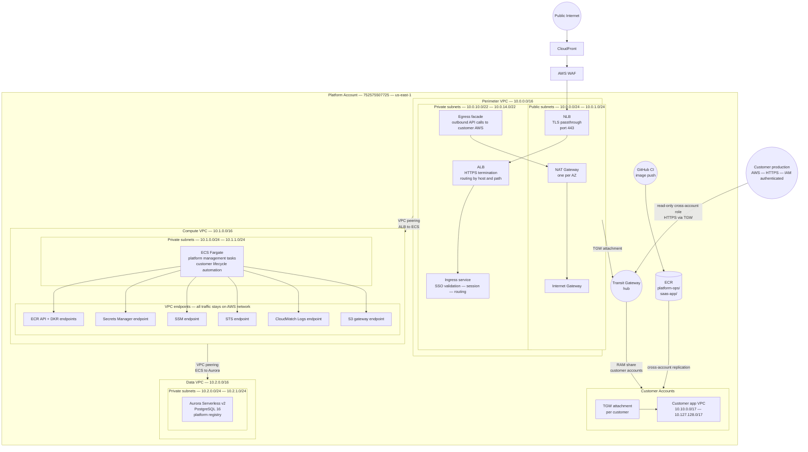

# Platform Account Network Topology

> **Narrative:** `architecture/platform/network-design.md`
> **Account reference:** `architecture/platform/account-structure.md`
> **Node taxonomy:** `architecture/diagrams/diagram-node-taxonomy.md`

---

## VPC Peering Summary

| Connection | Permitted traffic | Blocked traffic |
|---|---|---|
| Perimeter ↔ Compute | ALB to ECS (443) | All other traffic |
| Compute ↔ Data | ECS to Aurora (5432) | Perimeter to data directly |
| Perimeter ↔ Data | None — not peered | All — intentional |

The compute VPC has no internet route of any kind. All AWS API calls from
ECS tasks go exclusively through VPC interface and gateway endpoints.
The perimeter peering connection carries only ALB→ECS traffic.

The absence of a Perimeter ↔ Data peering is a deliberate security control.
Internet-facing infrastructure has no path to the database.

---

## Transit Gateway Route Table Intent

| Source attachment | Can reach | Cannot reach |
|---|---|---|
| Perimeter VPC | Any customer account CIDR | Other platform VPCs |
| Customer account A | Perimeter VPC only | Customer account B, C, N |
| Customer account B | Perimeter VPC only | Customer account A, C, N |

There are no routes between customer CIDRs in the TGW route table.

---

## Security Group Layering

Security groups enforce least-privilege within each VPC. The principle is
deny-by-default with explicit allow rules referencing security group IDs,
not CIDR ranges, wherever possible.

Detailed security group rules are defined in Terraform. See:
`infrastructure/environments/platform/`

---

## Terraform Resource Map

| Node ID | Diagram label | Terraform resource | Module |
|---|---|---|---|
| `PERIM_VPC` | Perimeter VPC — 10.0.0.0/16 | `aws_vpc.perimeter` | `network` |
| `PERIM_IGW` | Internet Gateway | `aws_internet_gateway.perimeter` | `network` |
| `PERIM_NAT` | NAT Gateway | `aws_nat_gateway.perimeter[*]` | `network` |
| `PERIM_PUB_SUBNET` | Public subnets | `aws_subnet.perimeter_public[*]` | `network` |
| `PERIM_PRIV_SUBNET` | Private subnets | `aws_subnet.perimeter_private[*]` | `network` |
| `PERIM_NLB` | NLB | Not yet deployed | — |
| `PERIM_ALB` | ALB | Not yet deployed | — |
| `PERIM_INGRESS` | Ingress service | Not yet deployed | — |
| `PERIM_EGRESS` | Egress facade | Not yet deployed | — |
| `PERIM_TGW_ATTACH` | TGW attachment — perimeter | `aws_ec2_transit_gateway_vpc_attachment.perimeter` | `transit_gateway` |
| `COMPUTE_VPC` | Compute VPC — 10.1.0.0/16 | `aws_vpc.compute` | `network` |
| `COMPUTE_PRIV_SUBNET` | Compute private subnets | `aws_subnet.compute_private[*]` | `network` |
| `COMPUTE_ECS_TASKS` | ECS Fargate platform tasks | `aws_ecs_cluster.platform` | `ecs_cluster` |
| `COMPUTE_EP_ECR_API` | ECR API endpoint | `aws_vpc_endpoint.compute_interface["ecr.api"]` | `network` |
| `COMPUTE_EP_ECR_DKR` | ECR DKR endpoint | `aws_vpc_endpoint.compute_interface["ecr.dkr"]` | `network` |
| `COMPUTE_EP_SM` | Secrets Manager endpoint | `aws_vpc_endpoint.compute_interface["secretsmanager"]` | `network` |
| `COMPUTE_EP_SSM` | SSM endpoint | `aws_vpc_endpoint.compute_interface["ssm"]` | `network` |
| `COMPUTE_EP_STS` | STS endpoint | `aws_vpc_endpoint.compute_interface["sts"]` | `network` |
| `COMPUTE_EP_LOGS` | CloudWatch Logs endpoint | `aws_vpc_endpoint.compute_interface["logs"]` | `network` |
| `COMPUTE_EP_S3` | S3 gateway endpoint | `aws_vpc_endpoint.compute_s3` | `network` |
| `COMPUTE_PERIM_PEER` | Peering — perimeter↔compute | `aws_vpc_peering_connection.perimeter_compute` | `network` |
| `DATA_VPC` | Data VPC — 10.2.0.0/16 | `aws_vpc.data` | `network` |
| `DATA_PRIV_SUBNET` | Data private subnets | `aws_subnet.data_private[*]` | `network` |
| `DATA_AURORA` | Aurora Serverless v2 | `aws_rds_cluster.platform` | `aurora` |
| `DATA_COMPUTE_PEER` | Peering — compute↔data | `aws_vpc_peering_connection.compute_data` | `network` |
| `PLAT_TGW` | Transit Gateway | `aws_ec2_transit_gateway.platform` | `transit_gateway` |
| `PLAT_ECR` | ECR repositories | `aws_ecr_repository.*` | `ecr` |
| `PLAT_CF` | CloudFront | Not yet deployed | — |
| `PLAT_WAF` | WAF | Not yet deployed | — |
| `CA_TGW_ATTACH` | Customer TGW attachment | `aws_ec2_transit_gateway_vpc_attachment.app` | `customer_network` |
| `CA_APP_VPC` | Customer app VPC | `aws_vpc.app` | `customer_network` |

---

## Related Documents

- `architecture/platform/network-design.md` — design rationale narrative
- `architecture/platform/account-structure.md` — account roles and IDs
- `architecture/platform/cross-account-access-model.md` — IAM access model
- `architecture/diagrams/diagram-node-taxonomy.md` — canonical node ID registry
- `diagrams/system-boundary.md` — organization-level boundary
- `diagrams/cross-account-access-flow.md` — IAM role assumption sequences
