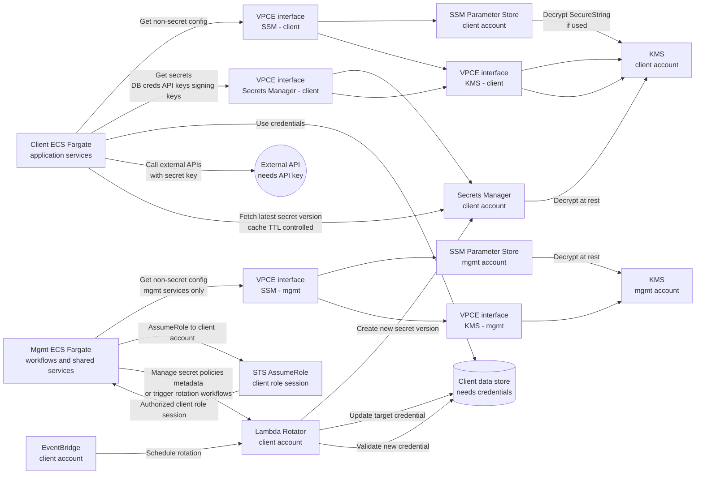

# Secrets + config retrieval and rotation (PerAccount config)

```mermaid

flowchart LR
  %% Workloads
  MgmtECS[Mgmt ECS Fargate<br>workflows and shared services]
  ClientECS[Client ECS Fargate<br>application services]

  %% Mgmt account config
  PSm[SSM Parameter Store<br>mgmt account]
  KMSm[KMS<br>mgmt account]
  VPCE_SSM_m[VPCE interface<br>SSM - mgmt]
  VPCE_KMS_m[VPCE interface<br>KMS - mgmt]

  %% Client account config + secrets
  PSc[SSM Parameter Store<br>client account]
  SMc[Secrets Manager<br>client account]
  KMSc[KMS<br>client account]
  VPCE_SSM_c[VPCE interface<br>SSM - client]
  VPCE_SM_c[VPCE interface<br>Secrets Manager - client]
  VPCE_KMS_c[VPCE interface<br>KMS - client]

  %% Rotation
  EBc[EventBridge<br>client account]
  RotLambda[Lambda Rotator<br>client account]
  ClientDB[(Client data store<br>needs credentials)]
  ExtAPI((External API<br>needs API key))

  %% Cross-account workflow boundary
  STS[STS AssumeRole<br>client role session]

  %% ---------------- Mgmt config retrieval (mgmt account) ----------------
  MgmtECS -->|Get non-secret config<br>mgmt services only| VPCE_SSM_m --> PSm
  PSm -->|Decrypt at rest| KMSm
  VPCE_SSM_m --> VPCE_KMS_m --> KMSm

  %% ---------------- Client config + secrets retrieval (client account) ----------------
  ClientECS -->|Get non-secret config| VPCE_SSM_c --> PSc
  ClientECS -->|Get secrets<br>DB creds API keys signing keys| VPCE_SM_c --> SMc

  SMc -->|Decrypt at rest| KMSc
  PSc -->|Decrypt SecureString<br>if used| KMSc
  VPCE_SM_c --> VPCE_KMS_c --> KMSc
  VPCE_SSM_c --> VPCE_KMS_c --> KMSc

  %% Secrets used
  ClientECS -->|Use credentials| ClientDB
  ClientECS -->|Call external APIs<br>with secret key| ExtAPI

  %% ---------------- Rotation (client account) ----------------
  EBc -->|Schedule rotation| RotLambda
  RotLambda -->|Create new secret version| SMc
  RotLambda -->|Update target credential| ClientDB
  RotLambda -->|Validate new credential| ClientDB

  %% Workloads pick up new version
  ClientECS -->|Fetch latest secret version<br>cache TTL controlled| SMc

  %% ---------------- Admin-triggered management actions ----------------
  MgmtECS -->|AssumeRole to client account| STS
  STS -->|Authorized client role session| MgmtECS
  MgmtECS -->|Manage secret policies metadata<br>or trigger rotation workflows| RotLambda

```
