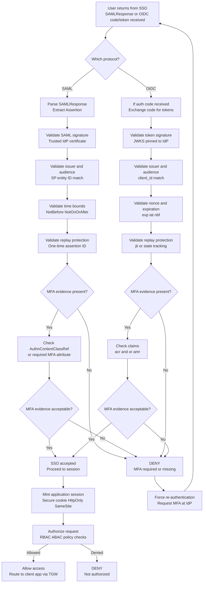

```mermaid
flowchart TD
  A[User returns from SSO<br>SAMLResponse or OIDC code/token received] --> B{Which protocol?}

  %% ---------------- SAML branch ----------------
  B -->|SAML| S1[Parse SAMLResponse<br>Extract Assertion]
  S1 --> S2[Validate SAML signature<br>Trusted IdP certificate]
  S2 --> S3[Validate issuer and audience<br>SP entity ID match]
  S3 --> S4[Validate time bounds<br>NotBefore NotOnOrAfter]
  S4 --> S5[Validate replay protection<br>One-time assertion ID]
  S5 --> S6{MFA evidence present?}
  S6 -->|Yes| S7[Check AuthnContextClassRef<br>or required MFA attribute]
  S6 -->|No| D1[DENY<br>MFA required or missing]
  S7 --> S8{MFA evidence acceptable?}
  S8 -->|No| D1
  S8 -->|Yes| OK1[SSO accepted<br>Proceed to session]

  %% ---------------- OIDC branch ----------------
  B -->|OIDC| O1[If auth code received<br>Exchange code for tokens]
  O1 --> O2[Validate token signature<br>JWKS pinned to IdP]
  O2 --> O3[Validate issuer and audience<br>client_id match]
  O3 --> O4[Validate nonce and expiration<br>exp iat nbf]
  O4 --> O5[Validate replay protection<br>jti or state tracking]
  O5 --> O6{MFA evidence present?}
  O6 -->|No| D1
  O6 -->|Yes| O7[Check claims<br>acr and or amr]
  O7 --> O8{MFA evidence acceptable?}
  O8 -->|No| D1
  O8 -->|Yes| OK1

  %% ---------------- Session and access ----------------
  OK1 --> SESS[Mint application session<br>Secure cookie HttpOnly SameSite]
  SESS --> AUTHZ[Authorize request<br>RBAC ABAC policy checks]
  AUTHZ -->|Allowed| PASS[Allow access<br>Route to client app via TGW]
  AUTHZ -->|Denied| D2[DENY<br>Not authorized]

  %% ---------------- Re-auth loop ----------------
  D1 --> REAUTH[Force re-authentication<br>Request MFA at IdP]
  REAUTH --> A
  
```
