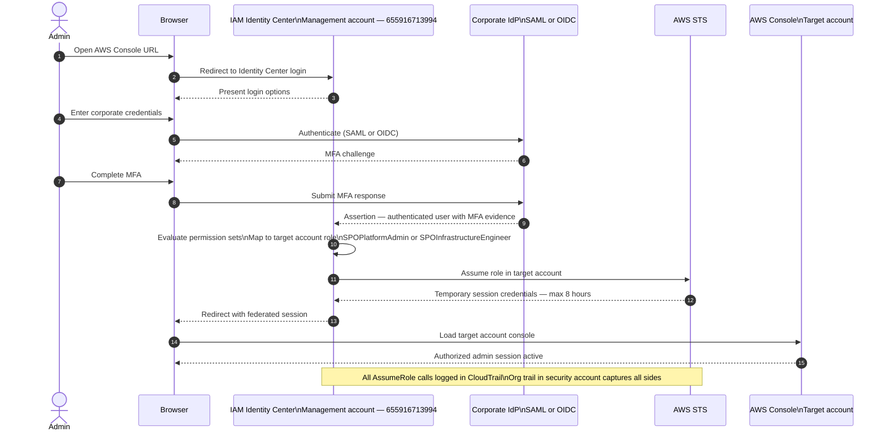

# Admin Login Sequence

> **Architecture reference:** `architecture/platform/cross-account-access-model.md`
> **Node taxonomy:** `architecture/diagrams/diagram-node-taxonomy.md`

This sequence shows how a platform administrator authenticates via IAM
Identity Center (SSO) to access the AWS Console.

---

## Permission sets

| Permission set | Scope | Typical use |
|---|---|---|
| `SPOPlatformAdmin` | Platform + security accounts | Infrastructure changes, Terraform apply |
| `SPOInfrastructureEngineer` | Platform + security accounts | Read, plan, limited apply |
| `SPOReadOnlyReviewer` | All accounts | Audit review, compliance verification |

---

## Related Documents

- `architecture/platform/cross-account-access-model.md` — access model design
- `architecture/diagrams/diagram-node-taxonomy.md` — canonical node ID registry
- `diagrams/sequence/admin-workflow.md` — admin workflow into customer account
