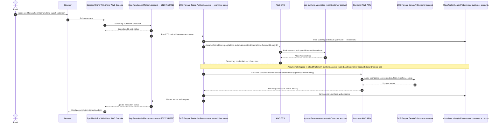

# Admin Workflow — Platform ECS Task into Customer Account

> **Architecture reference:** `architecture/platform/cross-account-access-model.md`
> **Node taxonomy:** `architecture/diagrams/diagram-node-taxonomy.md`

This sequence shows how an admin-triggered workflow executes via the
platform ECS Fargate cluster, assumes a cross-account role into a customer
account, and performs operations there. This is Pattern 1 from the
cross-account access model.

---

## Terraform Resource Map

| Node ID | Diagram label | Terraform resource | Module |
|---|---|---|---|
| `COMPUTE_ECS_TASKS` | ECS Fargate Task — Platform | `aws_ecs_cluster.platform` | `ecs_cluster` |
| `CA_BOOTSTRAP_ROLE` | spo-platform-automation-role | CloudFormation StackSet | `cloudformation/workload-account-onboarding.yaml` |
| `CA_ECS_CLUSTER` | ECS Fargate Service — Customer | `aws_ecs_cluster.customer` | `customer_ecs` |
| `SEC_CLOUDTRAIL` | CloudTrail org trail | CLI-managed | `security` |

---

## Related Documents

- `architecture/platform/cross-account-access-model.md` — full access model
- `diagrams/cross-account-access-flow.md` — role assumption flow diagrams
- `architecture/diagrams/diagram-node-taxonomy.md` — canonical node ID registry
- `diagrams/sequence/admin-login-sequence.md` — admin authentication sequence
