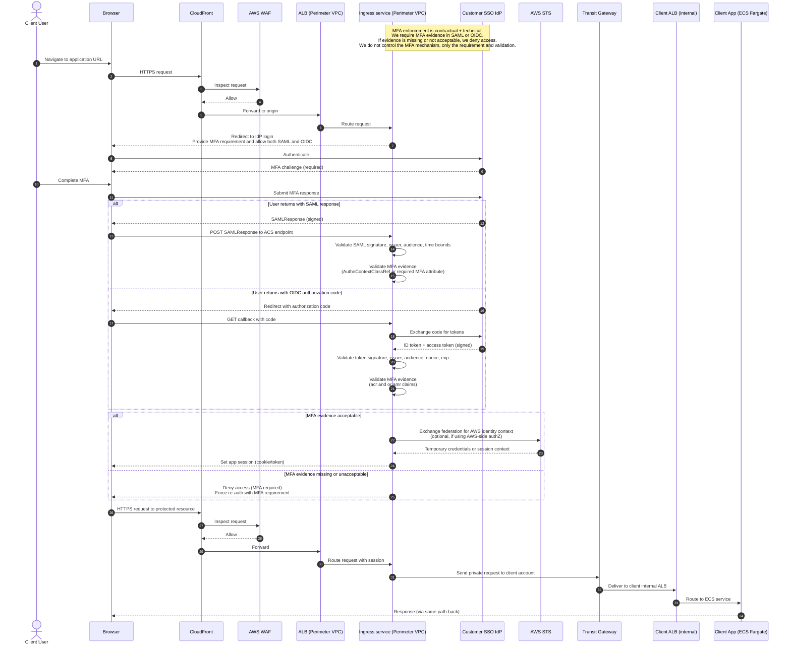

# Client user login sequence
Note: the client provides their own IdP. MFA is required, but must be configured by the client's IdP.

How this “ensures MFA” in a defensible way

You can’t force the client’s MFA method, but you can require proof that MFA happened.

In practice, that means the app only accepts SSO responses that contain MFA evidence.

Concrete implementation guidance

SAML
- Require the assertion to include an MFA-authn signal, typically in the AuthnContextClassRef value (IdP-specific), or in a specific attribute your integration contract requires.
- Reject assertions without that value.

OIDC
- Require an MFA indicator in claims, typically acr or amr (depends on IdP).
- Reject tokens that do not include the required acr/amr value.

