# System Boundary

> **Canonical account reference:** `architecture/platform/account-structure.md`
> **OU structure:** `architecture/platform/management-account.md`
> **Node taxonomy:** `architecture/diagrams/diagram-node-taxonomy.md`
>
> **Archived prior version:** `diagrams/archive/system-boundary-pre-platform.md`

```mermaid
flowchart TB

  %% ── External actors ──────────────────────────────────────────────
  %% spo:diagram-node = EXT_INTERNET
  Internet((Public Internet))
  %% spo:diagram-node = EXT_CUSTOMER_SSO
  CustomerIdP((Customer SSO IdP\nSAML or OIDC))
  %% spo:diagram-node = EXT_CUSTOMER_PROD_AWS
  CustomerProdAWS((Customer production\nAWS environment))
  %% spo:diagram-node = EXT_GITHUB_CI
  GitHubExt((Private GitHub repo\noutside boundary))

  %% ── AWS Organization boundary ────────────────────────────────────
  subgraph ORG[AWS Organization — SpecifierOnline — o-5uqxxe8fif]
    direction TB

    %% ── Management Account ───────────────────────────────────────
    subgraph MGMT[Management Account — 655916713994]
      direction LR
      %% spo:diagram-node = MGMT_ORG_ROOT
      MGMT_ORG[AWS Organizations root\nr-vowd]
      %% spo:diagram-node = MGMT_SCP
      MGMT_SCP[Service Control Policies\n4 SCPs — deny-leave-org at root\nothers on production OU children]
      %% spo:diagram-node = MGMT_BILLING
      MGMT_BILLING[Billing and cost management]
      %% spo:diagram-node = MGMT_STACKSET
      MGMT_STACKSET[StackSet — spo-customer-account-bootstrap\nauto-deploy to customer OU]
    end

    %% ── Production OU ────────────────────────────────────────────
    subgraph PROD_OU[production OU — ou-vowd-5nyvll04]
      direction TB

      %% ── Security Account ───────────────────────────────────────
      subgraph SEC[Security Account — 725644097230]
        direction LR
        %% spo:diagram-node = SEC_LOG_ARCHIVE
        SEC_ARCHIVE[Immutable log archive\nS3 — Object Lock — KMS]
        %% spo:diagram-node = SEC_GUARDDUTY
        %% spo:diagram-node = SEC_DETECTIVE
        %% spo:diagram-node = SEC_SECURITYHUB
        SEC_MON[Security monitoring\nGuardDuty — Detective — Security Hub]
        %% spo:diagram-node = SEC_CLOUDTRAIL
        SEC_CLOUDTRAIL[Organization CloudTrail\ndelegated administrator]
        %% spo:diagram-node = SEC_CONFIG
        SEC_CONFIG[AWS Config aggregator]
      end

      %% ── Platform Account ─────────────────────────────────────
      subgraph PLAT[Platform Account — 752575507725]
        direction TB

        %% spo:diagram-node = PERIM_VPC
        subgraph PLAT_PERIM[Perimeter VPC — 10.0.0.0/16]
          %% spo:diagram-node = PLAT_CF, PLAT_WAF
          PLAT_CF[CloudFront — WAF]
          %% spo:diagram-node = PERIM_NLB
          PLAT_NLB[NLB — TLS passthrough]
          %% spo:diagram-node = PERIM_ALB
          PLAT_ALB[ALB — HTTPS routing]
          %% spo:diagram-node = PERIM_NAT
          PLAT_NAT[NAT Gateway — egress]
        end

        %% spo:diagram-node = COMPUTE_VPC
        subgraph PLAT_COMPUTE[Compute VPC — 10.1.0.0/16]
          %% spo:diagram-node = COMPUTE_ECS_TASKS
          PLAT_ECS[ECS Fargate\nplatform management tasks]
          %% spo:diagram-node = COMPUTE_EP_ECR_API, COMPUTE_EP_ECR_DKR,
          %%                     COMPUTE_EP_SM, COMPUTE_EP_SSM,
          %%                     COMPUTE_EP_STS, COMPUTE_EP_LOGS, COMPUTE_EP_S3
          PLAT_ENDPOINTS[VPC endpoints\nECR — Secrets Manager — SSM — STS — Logs — S3\nNo internet route]
        end

        %% spo:diagram-node = DATA_VPC
        subgraph PLAT_DATA[Data VPC — 10.2.0.0/16]
          %% spo:diagram-node = DATA_AURORA
          PLAT_AURORA[Aurora Serverless v2\nconfig library — customer registry]
          %% spo:diagram-node = PLAT_ECR
          PLAT_ECR[ECR — master container images\nplatform-ops/ — saas-app/]
        end

        %% spo:diagram-node = PLAT_TGW
        PLAT_TGW((Transit Gateway\nhub))
      end

      %% ── Customer Accounts ────────────────────────────────────
      subgraph CUST[Customer Accounts — ou-vowd-ag305vmt\none per customer — CloudFormation StackSet auto-deploy]
        direction LR

        subgraph CUST_A[Customer Account A]
          %% spo:diagram-node = CA_ECS_CLUSTER
          CA_ECS[ECS Fargate\napp instance]
          %% spo:diagram-node = CA_AURORA
          CA_DB[(Aurora Serverless v2\ncustomer data)]
          %% spo:diagram-node = CA_ECR
          CA_ECR[ECR\nreplicated from platform]
          %% spo:diagram-node = CA_TGW_ATTACH
          CA_TGW_A((TGW attachment))
          %% spo:diagram-node = CA_BOOTSTRAP_ROLE
          CA_ROLES[Cross-account IAM roles\nread-only — write time-limited]
        end

        subgraph CUST_N[Customer Account N]
          CN_ECS[ECS Fargate\napp instance]
          CN_DB[(Aurora Serverless v2\ncustomer data)]
          CN_ECR[ECR\nreplicated from platform]
          CN_TGW_N((TGW attachment))
          CN_ROLES[Cross-account IAM roles\nread-only — write time-limited]
        end
      end

    end

    %% ── Sandbox OU ───────────────────────────────────────────────
    subgraph SANDBOX[sandbox OU — ou-vowd-9kvxi8en\nNo SCPs — outside production compliance boundary]
      SANDBOX_ACCT[spo-sandbox — 546494700063]
    end

  end

  %% ── Flows ────────────────────────────────────────────────────────
  Internet -->|HTTPS| PLAT_CF
  CustomerIdP -->|SAML or OIDC auth response| PLAT_CF
  PLAT_CF --> PLAT_NLB --> PLAT_ALB --> PLAT_ECS
  PLAT_ALB -->|private — TGW routed| PLAT_TGW
  PLAT_TGW -->|attachment| CA_TGW_A --> CA_ECS
  PLAT_TGW -->|attachment| CN_TGW_N --> CN_ECS
  PLAT_ECS -->|AssumeRole — scoped automation| CA_ROLES
  PLAT_ECS -->|AssumeRole — scoped automation| CN_ROLES
  CA_ECS -->|AssumeRole — read-only| CustomerProdAWS
  CN_ECS -->|AssumeRole — read-only| CustomerProdAWS
  PLAT_NAT -->|HTTPS outbound — IAM authenticated| CustomerProdAWS
  PLAT_ECS -->|VPC Flow Logs — CloudWatch Logs| SEC_ARCHIVE
  CA_ECS -->|VPC Flow Logs — CloudWatch Logs| SEC_ARCHIVE
  CN_ECS -->|VPC Flow Logs — CloudWatch Logs| SEC_ARCHIVE
  MGMT_ORG -->|CloudTrail org trail| SEC_CLOUDTRAIL
  GitHubExt -->|CI push — image build| PLAT_ECR
  PLAT_ECR -->|cross-account replication| CA_ECR
  PLAT_ECR -->|cross-account replication| CN_ECR
  MGMT_SCP -->|organization policies| PROD_OU
  MGMT_STACKSET -->|provisions| CUST_A
  MGMT_STACKSET -->|provisions| CUST_N
```

---

## Trust Zones

| Zone | Accounts | Trust Level |
|---|---|---|
| Administrative root | Management account | Highest — break-glass only |
| Security boundary | Security account | High — read all, write none except log archive |
| Platform operator | Platform account | High — write to customer accounts via scoped roles only |
| Customer isolation | Customer accounts | Medium — isolated from each other, no direct access |
| External | Customer IdPs, customer production AWS | Low — authenticated, least-privilege |

---

## What Is Outside the Boundary

The following are outside the SpecifierOnline system boundary:

- Customer production AWS environments (read via cross-account role — data
  crosses the boundary inbound)
- Customer SSO identity providers (authentication only — no data stored)
- GitHub (image source — SBOM attestation required, no runtime access)
- Any external SIEM or analytics platform a customer may operate independently

---

## Terraform Resource Map

| Node ID | Diagram label | Terraform resource | Environment/Module |
|---|---|---|---|
| `MGMT_ORG_ROOT` | AWS Organizations root | `module.organization` | `management` |
| `MGMT_SCP` | Service Control Policies | `module.organization.aws_organizations_policy.*` | `management` |
| `MGMT_STACKSET` | CloudFormation StackSet | `aws_cloudformation_stack_set.spo_customer_account_bootstrap` | `management` (CLI-managed) |
| `SEC_LOG_ARCHIVE` | Immutable log archive | `module.log_archive.aws_s3_bucket.security_log_archive` | `security` |
| `SEC_CLOUDTRAIL` | Organization CloudTrail | CLI-managed — see deploy-security-environment.md | `security` |
| `SEC_GUARDDUTY` | GuardDuty | `module.guardduty.aws_guardduty_detector.security` | `security` |
| `SEC_DETECTIVE` | Detective | `module.detective.aws_detective_graph.security` | `security` |
| `SEC_SECURITYHUB` | Security Hub | `module.compliance_validation.aws_securityhub_account.security` | `security` |
| `SEC_CONFIG` | AWS Config | `module.compliance_validation.aws_config_configuration_recorder.security` | `security` |
| `PERIM_VPC` | Perimeter VPC | `module.network.aws_vpc.perimeter` | `platform/network` |
| `PLAT_CF` | CloudFront | Not yet deployed | — |
| `PLAT_WAF` | WAF | Not yet deployed | — |
| `PERIM_NLB` | NLB | Not yet deployed | — |
| `PERIM_ALB` | ALB | Not yet deployed | — |
| `PERIM_NAT` | NAT Gateway | `module.network.aws_nat_gateway.perimeter[*]` | `platform/network` |
| `COMPUTE_VPC` | Compute VPC | `module.network.aws_vpc.compute` | `platform/network` |
| `COMPUTE_ECS_TASKS` | ECS Fargate platform tasks | `module.ecs_cluster.aws_ecs_cluster.platform` | `platform/ecs_cluster` |
| `COMPUTE_EP_*` | VPC endpoints | `module.network.aws_vpc_endpoint.*` | `platform/network` |
| `DATA_VPC` | Data VPC | `module.network.aws_vpc.data` | `platform/network` |
| `DATA_AURORA` | Aurora Serverless v2 | `module.aurora.aws_rds_cluster.platform` | `platform/aurora` |
| `PLAT_ECR` | ECR registries | `module.ecr.aws_ecr_repository.*` | `platform/ecr` |
| `PLAT_TGW` | Transit Gateway | `module.transit_gateway.aws_ec2_transit_gateway.platform` | `platform/transit_gateway` |
| `CA_BOOTSTRAP_ROLE` | Cross-account IAM roles | CloudFormation StackSet | `cloudformation/workload-account-onboarding.yaml` |
| `CA_TGW_ATTACH` | Customer TGW attachment | `module.customer_network.aws_ec2_transit_gateway_vpc_attachment.app` | `customers/customer_network` |
| `CA_ECS_CLUSTER` | Customer ECS Fargate | `module.customer_ecs.aws_ecs_cluster.customer` | `customers/customer_ecs` |
| `CA_AURORA` | Customer Aurora | `module.customer_data.aws_rds_cluster.customer` | `customers/customer_data` |
| `CA_ECR` | Customer ECR | ECR cross-account replication | `platform/ecr` |

---

## Related Documents

- `architecture/platform/account-structure.md` — canonical account reference
- `architecture/platform/management-account.md` — OU structure and SCPs
- `architecture/platform/network-design.md` — VPC topology and routing
- `architecture/platform/cross-account-access-model.md` — IAM access model
- `architecture/diagrams/diagram-node-taxonomy.md` — canonical node ID registry
- `architecture/customer-account/isolation-model.md` — customer isolation
- `diagrams/platform-account-network.md` — detailed network topology
- `diagrams/dataflows.md` — data flow diagrams by flow type
